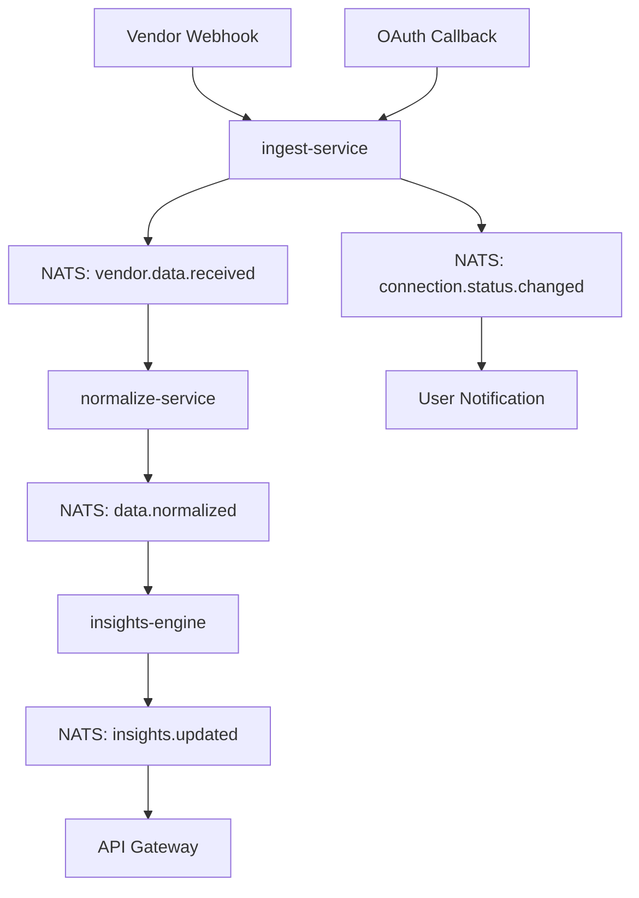

# Phase 3 API 合约 - 共享现实文档 (SRD)

**版本**: 1.0.0  
**日期**: 2025年9月27日  
**状态**: 草案  
**目标**: 定义 Phase 3 新服务间的 API 合约和数据流

## 概述

本文档定义了 Phase 3: Holistic Performance Hub 中新增服务的 API 合约，包括：
- `ingest-service`: 处理第三方供应商 webhook 和 OAuth
- `normalize-service`: 规范化供应商数据到标准格式
- `insights-engine`: 计算 readiness 和生成洞察

## 服务边界和职责

### ingest-service
**职责**: 第三方数据摄取和认证管理
- 处理 OAuth 2.0/OIDC 流程
- 接收和验证供应商 webhook
- 管理访问令牌和刷新令牌
- 提供数据摄取状态 API

### normalize-service
**职责**: 数据标准化和存储
- 将供应商特定数据转换为标准格式
- 执行数据验证和清理
- 存储到标准化数据表
- 处理数据重复和冲突解决

### insights-engine
**职责**: 洞察计算和推荐
- 计算 readiness 评分
- 生成训练调整建议
- 检测异常和趋势
- 提供个性化洞察

## API 合约规范

### 1. ingest-service API

#### OAuth 管理端点

```typescript
// 启动 OAuth 流程
POST /api/v1/connections/:vendor/link
Request: {
  userId: string;
  redirectUri?: string;
}
Response: {
  authUrl: string;
  state: string;
}

// OAuth 回调处理
POST /api/v1/connections/:vendor/callback
Request: {
  code: string;
  state: string;
  userId: string;
}
Response: {
  connectionId: string;
  status: 'active' | 'pending' | 'failed';
}

// 撤销连接
DELETE /api/v1/connections/:vendor/:connectionId
Response: {
  success: boolean;
  revokedAt: string;
}
```

#### Webhook 接收端点

```typescript
// 接收供应商 webhook
POST /api/v1/webhooks/:vendor
Headers: {
  'X-Vendor-Signature': string;
  'X-Vendor-Timestamp': string;
}
Request: {
  // 供应商特定格式，由 normalize-service 处理
  [key: string]: any;
}
Response: {
  received: boolean;
  messageId: string;
}
```

#### 连接状态端点

```typescript
// 获取用户连接状态
GET /api/v1/connections/:userId
Response: {
  connections: Array<{
    vendor: string;
    connectionId: string;
    status: 'active' | 'expired' | 'revoked';
    lastSync: string;
    permissions: string[];
  }>;
}

// 获取特定连接详情
GET /api/v1/connections/:vendor/:connectionId
Response: {
  vendor: string;
  connectionId: string;
  userId: string;
  status: string;
  permissions: string[];
  createdAt: string;
  lastSync: string;
  expiresAt?: string;
}
```

### 2. normalize-service API

#### 数据规范化端点

```typescript
// 处理 HRV 数据
POST /api/v1/normalize/hrv
Request: {
  userId: string;
  vendor: string;
  rawData: {
    date: string; // YYYY-MM-DD
    rMSSD?: number;
    lnRMSSD?: number;
    restingHR?: number;
    capturedAt: string;
    [key: string]: any; // 供应商特定字段
  };
}
Response: {
  normalized: boolean;
  dataId: string;
  conflicts?: Array<{
    field: string;
    existingValue: any;
    newValue: any;
    resolution: 'keep_existing' | 'use_new' | 'manual';
  }>;
}

// 处理睡眠数据
POST /api/v1/normalize/sleep
Request: {
  userId: string;
  vendor: string;
  rawData: {
    date: string; // YYYY-MM-DD
    durationMin: number;
    efficiencyPct?: number;
    latencyMin?: number;
    wakeCount?: number;
    capturedAt: string;
    [key: string]: any; // 供应商特定字段
  };
}
Response: {
  normalized: boolean;
  dataId: string;
  conflicts?: Array<{
    field: string;
    existingValue: any;
    newValue: any;
    resolution: 'keep_existing' | 'use_new' | 'manual';
  }>;
}
```

#### 数据查询端点

```typescript
// 获取 HRV 数据
GET /api/v1/data/hrv/:userId?from=YYYY-MM-DD&to=YYYY-MM-DD
Response: {
  data: Array<{
    userId: string;
    date: string;
    rMSSD?: number;
    lnRMSSD?: number;
    restingHR?: number;
    vendor: string;
    capturedAt: string;
    dataQuality: 'high' | 'medium' | 'low';
  }>;
  summary: {
    totalRecords: number;
    dateRange: {
      from: string;
      to: string;
    };
    dataQuality: {
      high: number;
      medium: number;
      low: number;
    };
  };
}

// 获取睡眠数据
GET /api/v1/data/sleep/:userId?from=YYYY-MM-DD&to=YYYY-MM-DD
Response: {
  data: Array<{
    userId: string;
    date: string;
    durationMin: number;
    efficiencyPct?: number;
    latencyMin?: number;
    wakeCount?: number;
    vendor: string;
    capturedAt: string;
    dataQuality: 'high' | 'medium' | 'low';
  }>;
  summary: {
    totalRecords: number;
    dateRange: {
      from: string;
      to: string;
    };
    averageDuration: number;
    averageEfficiency: number;
  };
}
```

### 3. insights-engine API

#### Readiness 计算端点

```typescript
// 计算当前 readiness
GET /api/v1/readiness/:userId/today
Response: {
  userId: string;
  date: string;
  readiness: {
    score: number; // 0-100
    level: 'low' | 'moderate' | 'high';
    drivers: Array<{
      factor: 'hrv' | 'sleep' | 'fatigue' | 'training_load';
      impact: 'positive' | 'negative' | 'neutral';
      weight: number; // 0-1
      description: string;
    }>;
    confidence: number; // 0-1
    lastUpdated: string;
  };
  recommendations: Array<{
    type: 'training_adjustment' | 'recovery_focus' | 'monitoring';
    priority: 'high' | 'medium' | 'low';
    description: string;
    action?: string;
  }>;
}

// 获取 readiness 历史
GET /api/v1/readiness/:userId/history?from=YYYY-MM-DD&to=YYYY-MM-DD
Response: {
  data: Array<{
    date: string;
    readiness: number;
    level: string;
    drivers: Array<{
      factor: string;
      impact: string;
      weight: number;
    }>;
    confidence: number;
  }>;
  trends: {
    averageReadiness: number;
    trend: 'improving' | 'stable' | 'declining';
    volatility: number; // 0-1
  };
}
```

#### 洞察生成端点

```typescript
// 生成个性化洞察
GET /api/v1/insights/:userId/weekly?weekStart=YYYY-MM-DD
Response: {
  userId: string;
  weekStart: string;
  insights: Array<{
    type: 'performance' | 'recovery' | 'consistency' | 'anomaly';
    title: string;
    description: string;
    impact: 'high' | 'medium' | 'low';
    actionable: boolean;
    recommendations?: string[];
  }>;
  summary: {
    readinessTrend: 'improving' | 'stable' | 'declining';
    sleepQuality: 'excellent' | 'good' | 'fair' | 'poor';
    trainingLoad: 'optimal' | 'high' | 'low';
    keyHighlights: string[];
  };
}

// 获取异常检测结果
GET /api/v1/insights/:userId/anomalies?from=YYYY-MM-DD&to=YYYY-MM-DD
Response: {
  anomalies: Array<{
    date: string;
    type: 'hrv_spike' | 'sleep_disruption' | 'readiness_drop' | 'data_gap';
    severity: 'low' | 'medium' | 'high';
    description: string;
    potentialCauses: string[];
    recommendedActions: string[];
  }>;
}
```

## 事件驱动架构

### NATS 事件流

#### 事件类型定义

```typescript
// 数据摄取事件
interface VendorDataReceived {
  type: 'vendor.data.received';
  payload: {
    messageId: string;
    userId: string;
    vendor: string;
    dataType: 'hrv' | 'sleep' | 'activity';
    rawData: any;
    receivedAt: string;
  };
}

// 数据规范化事件
interface DataNormalized {
  type: 'data.normalized';
  payload: {
    messageId: string;
    userId: string;
    vendor: string;
    dataType: 'hrv' | 'sleep';
    normalizedData: any;
    dataId: string;
    normalizedAt: string;
  };
}

// 洞察更新事件
interface InsightsUpdated {
  type: 'insights.updated';
  payload: {
    userId: string;
    date: string;
    readiness: {
      score: number;
      level: string;
      drivers: any[];
    };
    insights: any[];
    updatedAt: string;
  };
}

// 连接状态变更事件
interface ConnectionStatusChanged {
  type: 'connection.status.changed';
  payload: {
    userId: string;
    vendor: string;
    connectionId: string;
    oldStatus: string;
    newStatus: string;
    changedAt: string;
  };
}
```

#### 事件流设计



## 数据格式标准化

### HRV 数据标准格式

```typescript
interface StandardHRVData {
  userId: string;
  date: string; // YYYY-MM-DD
  rMSSD?: number; // Root Mean Square of Successive Differences
  lnRMSSD?: number; // Natural log of rMSSD
  restingHR?: number; // Resting Heart Rate
  vendor: string;
  capturedAt: string; // ISO 8601
  dataQuality: 'high' | 'medium' | 'low';
  metadata?: {
    measurementDuration?: number; // minutes
    deviceType?: string;
    [key: string]: any;
  };
}
```

### 睡眠数据标准格式

```typescript
interface StandardSleepData {
  userId: string;
  date: string; // YYYY-MM-DD
  durationMin: number; // Total sleep duration in minutes
  efficiencyPct?: number; // Sleep efficiency percentage
  latencyMin?: number; // Sleep latency in minutes
  wakeCount?: number; // Number of wake episodes
  vendor: string;
  capturedAt: string; // ISO 8601
  dataQuality: 'high' | 'medium' | 'low';
  metadata?: {
    sleepStages?: {
      light: number;
      deep: number;
      rem: number;
    };
    deviceType?: string;
    [key: string]: any;
  };
}
```

## 错误处理和重试策略

### 错误响应格式

```typescript
interface ErrorResponse {
  error: {
    code: string;
    message: string;
    details?: any;
    timestamp: string;
    requestId: string;
  };
}
```

### 重试策略

- **Webhook 接收**: 最多重试 3 次，指数退避
- **数据规范化**: 最多重试 5 次，线性退避
- **洞察计算**: 最多重试 2 次，立即重试
- **OAuth 流程**: 不重试，返回错误给用户

## 安全考虑

### 认证和授权

- 所有 API 端点需要有效的 JWT token
- OAuth 流程使用 PKCE (Proof Key for Code Exchange)
- Webhook 验证使用 HMAC 签名

### 数据保护

- 敏感数据在传输和存储时加密
- 个人健康数据访问需要明确同意
- 审计日志记录所有数据访问

## 性能要求

### 响应时间目标

- **OAuth 流程**: < 2 秒
- **Webhook 处理**: < 500ms
- **数据查询**: < 1 秒
- **Readiness 计算**: < 2 秒

### 可用性目标

- **服务可用性**: 99.9%
- **数据一致性**: 最终一致性
- **故障恢复**: < 5 分钟

---

**注意**: 此文档将在架构设计工作坊中进一步细化和确认。所有 API 合约都需要经过安全审查和性能测试。
