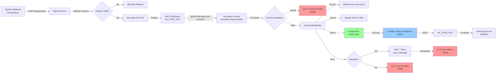

# Sleep Event Flow Architecture

End-to-end flow for Sleep data ingestion, normalization, and distribution.

## Overview

The Sleep event pipeline processes sleep metrics from vendor webhooks (Oura, Whoop) through validation, normalization, database persistence, and event distribution to downstream consumers (planning engine, analytics).

**Key Characteristics**:
- **Event-driven**: Async messaging via NATS JetStream
- **Fault-tolerant**: DLQ routing for failed messages, retry logic for transient errors
- **Idempotent**: Upsert on userId+date prevents duplicate rows
- **Observable**: Prometheus metrics, OpenTelemetry traces, structured logs

---

## System Architecture



---

## Event Schemas

### SleepRawReceivedEvent

Published by **Ingest Service** after accepting raw Sleep data.

**Subject**: `athlete-ally.sleep.raw-received`

**Schema**:
```typescript
{
  eventId: string;              // Auto-generated UUID
  payload: {
    userId: string;             // User identifier
    date: string;               // ISO date (YYYY-MM-DD)
    durationMinutes: number;    // Total sleep duration (non-negative)
    capturedAt?: string;        // ISO timestamp (auto-generated if not provided)
    raw?: Record<string, unknown>;  // Vendor metadata
  };
}
```

**Example**:
```json
{
  "eventId": "evt_abc123...",
  "payload": {
    "userId": "user-456",
    "date": "2025-10-02",
    "durationMinutes": 420,
    "capturedAt": "2025-10-02T08:30:00Z",
    "raw": {
      "source": "oura",
      "qualityScore": 85,
      "deepSleep": 120,
      "remSleep": 90
    }
  }
}
```

---

### SleepNormalizedStoredEvent

Published by **Normalize Service** after successful database persistence.

**Subject**: `athlete-ally.sleep.normalized-stored`

**Schema**:
```typescript
{
  record: {
    userId: string;
    date: string;                    // ISO date
    durationMinutes: number;
    qualityScore?: number;           // 0-100 (clamped), undefined if not provided
    vendor: 'oura' | 'whoop' | 'unknown';
    capturedAt: string;              // ISO timestamp
  };
}
```

**Example**:
```json
{
  "record": {
    "userId": "user-456",
    "date": "2025-10-02",
    "durationMinutes": 420,
    "qualityScore": 85,
    "vendor": "oura",
    "capturedAt": "2025-10-02T08:30:00Z"
  }
}
```

---

## Processing Flow

### 1. Ingestion (Ingest Service)

**Endpoint**: `POST /api/v1/ingest/sleep`

**Steps**:
1. Fastify receives HTTP POST with JSON body
2. Zod schema validation:
   - userId: non-empty string
   - date: ISO date format `YYYY-MM-DD`
   - durationMinutes: non-negative integer
   - raw: optional object
3. Generate `eventId` (UUID)
4. Create `SleepRawReceivedEvent`
5. Schema validation via `eventValidator.validateEvent('sleep_raw_received', event)`
6. Publish to NATS subject `athlete-ally.sleep.raw-received`
7. Return 200 OK with `{ message, eventId }`

**Error Paths**:
- Invalid schema → 400 Bad Request
- NATS unavailable → 500 Internal Server Error

---

### 2. Normalization (Normalize Service)

**Consumer**: `normalize-sleep-durable` (durable pull consumer)

**Steps**:
1. **Fetch batch**: `sub.pull({ batch: 10, expires: 5000 })`
2. **For each message**:
   a. Extract OpenTelemetry trace context from headers
   b. Create span: `normalize.sleep.consume`
   c. **Schema validation**: `eventValidator.validateEvent('sleep_raw_received', eventData)`
      - If invalid → Publish to `dlq.normalize.sleep.raw-received.schema-invalid` + `m.term()`
   d. **Process data**:
      - Extract `vendor` from `raw.source` (fallback: 'unknown')
      - Clamp `qualityScore` to 0-100 range (null if missing)
      - Calculate `capturedAt` (use provided or current timestamp)
   e. **Database upsert**:
      - Table: `sleep_data`
      - Unique constraint: `userId + date`
      - Fields: `durationMinutes`, `qualityScore`, `vendor`, `capturedAt`
   f. **Publish normalized event**: `athlete-ally.sleep.normalized-stored`
   g. **ACK message**: `m.ack()`
   h. **Record metrics**: `normalize_sleep_messages_total{result="success"}`

**Error Handling**:
- **Retryable errors** (ECONNREFUSED, timeout, ETIMEDOUT, Connection, ENOTFOUND):
  - `m.nak(5000)` (5-second delay)
  - Increment `normalize_sleep_messages_total{result="retry"}`
  - Retry up to 5 times
- **Non-retryable errors** (business logic, validation):
  - Publish to `dlq.normalize.sleep.raw-received.non-retryable`
  - `m.term()`
  - Increment `normalize_sleep_messages_total{result="dlq"}`
- **Retry exhaustion** (deliveryCount >= 5):
  - Publish to `dlq.normalize.sleep.raw-received.max-deliver`
  - `m.term()`
  - Increment `normalize_sleep_messages_total{result="dlq"}`

**Heartbeat**: `m.working()` called every 3 messages to extend ACK deadline

---

### 3. Distribution (Downstream Consumers)

**Subject**: `athlete-ally.sleep.normalized-stored`

**Consumers**:
- Planning Engine: Generate training plans based on sleep quality
- Analytics Service: Aggregate sleep metrics for dashboards
- Notification Service: Alert users on poor sleep quality

---

## Data Transformations

### Vendor Extraction

**Input**: `raw.source` from vendor metadata

**Logic**:
```typescript
const vendor = (raw && typeof raw === 'object' && 'source' in raw && typeof raw.source === 'string')
  ? raw.source
  : 'unknown';
```

**Examples**:
- `raw: { source: 'oura' }` → `vendor: 'oura'`
- `raw: { source: 'whoop' }` → `vendor: 'whoop'`
- `raw: {}` → `vendor: 'unknown'`
- `raw: undefined` → `vendor: 'unknown'`

---

### Quality Score Clamping

**Input**: `raw.qualityScore` (any number)

**Logic**:
```typescript
const qualityScore = (raw && typeof raw === 'object' && 'qualityScore' in raw && typeof raw.qualityScore === 'number')
  ? Math.min(100, Math.max(0, raw.qualityScore))
  : null;
```

**Examples**:
- `raw.qualityScore: 85` → `qualityScore: 85`
- `raw.qualityScore: 150` → `qualityScore: 100` (clamped)
- `raw.qualityScore: -20` → `qualityScore: 0` (clamped)
- `raw: {}` → `qualityScore: null`

---

## Dead Letter Queue (DLQ)

### DLQ Subjects

| Subject | Reason | Action |
|---------|--------|--------|
| `dlq.normalize.sleep.raw-received.schema-invalid` | Event failed schema validation | Review event structure, fix publisher |
| `dlq.normalize.sleep.raw-received.max-deliver` | Retry exhaustion (5 attempts) | Investigate root cause (DB down, NATS issues) |
| `dlq.normalize.sleep.raw-received.non-retryable` | Business logic error | Fix data issue, replay message |

### DLQ Stream

**Stream**: `AA_DLQ`

**Retention**: 7 days (configurable)

**Inspection**:
```bash
# View latest schema-invalid message
nats stream view AA_DLQ --last-by-subject="dlq.normalize.sleep.raw-received.schema-invalid"

# Get specific message by sequence
nats stream get AA_DLQ <seq> --json | jq '.data | @base64d | fromjson'
```

**Replay**:
```bash
# After fixing issue, republish to original subject
nats pub athlete-ally.sleep.raw-received "$(nats stream get AA_DLQ <seq> --raw)"
```

---

## Observability

### Metrics

**Ingest Service**:
- `event_bus_events_published_total{topic="sleep_raw_received", status="success|error"}`
- `event_bus_schema_validation_total{topic="sleep_raw_received", status="attempted|success"}`

**Normalize Service**:
- `normalize_sleep_messages_total{result="success|schema_invalid|retry|dlq", subject, stream, durable}`

### Tracing

**Span Hierarchy**:
```
ingest.sleep.publish
  └─ normalize.sleep.consume
      └─ processSleepData (implicit, not a separate span)
```

**Trace Context Propagation**:
1. Ingest service creates root span, injects trace context into NATS headers
2. Normalize service extracts trace context, creates child span
3. Downstream consumers continue the trace

### Logs

**Key Log Messages**:
- `[ingest] Publishing to subject: athlete-ally.sleep.raw-received`
- `[normalize] Processing Sleep message: {streamSeq, deliverySeq, redeliveries}`
- `[normalize] Sleep validation passed, processing data...`
- `[normalize] Sleep data processed successfully`
- `[normalize] Sleep validation failed: {errors}` (DLQ path)
- `[normalize] maxDeliver reached, sending to DLQ: {dlqSubject, attempt}`

---

## Failure Scenarios

### Scenario 1: Invalid Date Format

**Input**: `{"userId": "u1", "date": "10/02/2025", "durationMinutes": 420}`

**Flow**:
1. Ingest service validates request → **400 Bad Request** (Zod validation fails)
2. Event NOT published to NATS
3. Client receives error: `{"error": "Validation failed", "details": ["date: Invalid date format"]}`

---

### Scenario 2: Missing durationMinutes

**Input**: `{"userId": "u1", "date": "2025-10-02"}`

**Flow**:
1. Ingest service validates request → **400 Bad Request** (missing required field)
2. Event NOT published
3. Client receives error: `{"error": "Validation failed", "details": ["durationMinutes: Required"]}`

---

### Scenario 3: Database Connection Failure (Retryable)

**Input**: Valid Sleep event published to NATS

**Flow**:
1. Normalize service fetches message
2. Schema validation passes
3. Database upsert fails with `ECONNREFUSED` (PostgreSQL down)
4. Error classified as **retryable**
5. `m.nak(5000)` → message requeued with 5s delay
6. Metric incremented: `normalize_sleep_messages_total{result="retry"}`
7. Consumer retries (up to 5 attempts)
8. If PostgreSQL recovers → message processes successfully
9. If retries exhausted → DLQ `.max-deliver`

---

### Scenario 4: Schema Validation Failure at Normalize Layer

**Input**: Event published with invalid payload (malformed JSON, missing fields after publish)

**Flow**:
1. Normalize service fetches message
2. Schema validation via `eventValidator.validateEvent()` **fails**
3. Classified as **non-retryable** (schema issue won't fix itself)
4. Publish to `dlq.normalize.sleep.raw-received.schema-invalid`
5. `m.term()` → message permanently removed from consumer
6. Metric incremented: `normalize_sleep_messages_total{result="schema_invalid"}`
7. Alert triggers (if configured): "Schema validation failures > threshold"

---

## Performance Characteristics

**Throughput**:
- Ingest: ~500 req/s (single instance, synchronous publish)
- Normalize: ~100 msg/s (batch size 10, 5s expires, includes DB write)

**Latency** (P95):
- Ingest → NATS publish: <50ms
- NATS → Normalize ACK: <500ms (including DB upsert)
- End-to-end (ingest → normalized event published): <600ms

**Resource Usage** (per service instance):
- CPU: <0.5 cores idle, <2 cores at peak
- Memory: <512MB (normalize service with Prisma client loaded)
- Database connections: 10 (Prisma connection pool)

---

## Related Documentation

- [Ingest Service README](../../services/ingest-service/README.md)
- [Normalize Service README](../../services/normalize-service/README.md)
- [Sleep Troubleshooting Runbook](../runbook/sleep-troubleshooting.md)
- [Event Bus Configuration](../../packages/event-bus/README.md)
