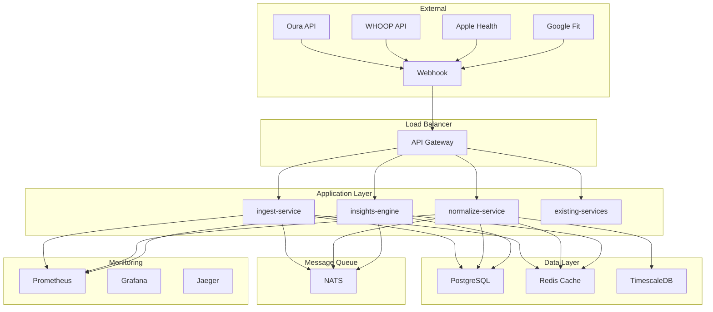

# Phase 3 基础设施蓝图

**版本**: 1.0.0  
**日期**: 2025年9月27日  
**状态**: 草案  
**目标**: 设计 Phase 3 新服务的基础设施架构

## 概述

本文档定义了 Phase 3: Holistic Performance Hub 的基础设施蓝图，包括：
- 微服务架构设计
- 容器化和编排策略
- 数据存储和缓存策略
- 监控和可观测性
- 部署和扩展策略

## 整体架构设计

### 1. 系统架构图



### 2. 服务拓扑

```typescript
interface ServiceTopology {
  // 新服务
  newServices: {
    'ingest-service': ServiceConfig;
    'normalize-service': ServiceConfig;
    'insights-engine': ServiceConfig;
  };
  
  // 现有服务
  existingServices: {
    'gateway-bff': ServiceConfig;
    'workouts': ServiceConfig;
    'planning-engine': ServiceConfig;
    'exercises': ServiceConfig;
    'fatigue': ServiceConfig;
  };
  
  // 共享服务
  sharedServices: {
    'postgresql': DatabaseConfig;
    'redis': CacheConfig;
    'nats': MessageQueueConfig;
    'prometheus': MonitoringConfig;
    'grafana': MonitoringConfig;
    'jaeger': TracingConfig;
  };
}

interface ServiceConfig {
  replicas: number;
  resources: {
    cpu: string;
    memory: string;
    storage?: string;
  };
  healthCheck: HealthCheckConfig;
  scaling: ScalingConfig;
  networking: NetworkingConfig;
}
```

## 容器化策略

### 1. Docker 镜像设计

```dockerfile
# ingest-service Dockerfile
FROM node:20-alpine AS builder

WORKDIR /app
COPY package*.json ./
RUN npm ci --only=production

FROM node:20-alpine AS runtime

# 创建非 root 用户
RUN addgroup -g 1001 -S nodejs
RUN adduser -S nodejs -u 1001

WORKDIR /app

# 复制构建产物
COPY --from=builder /app/node_modules ./node_modules
COPY --chown=nodejs:nodejs . .

# 设置安全配置
USER nodejs
EXPOSE 3000

# 健康检查
HEALTHCHECK --interval=30s --timeout=3s --start-period=5s --retries=3 \
  CMD curl -f http://localhost:3000/health || exit 1

CMD ["node", "dist/index.js"]
```

### 2. 多阶段构建优化

```dockerfile
# 优化后的 Dockerfile
FROM node:20-alpine AS dependencies
WORKDIR /app
COPY package*.json ./
RUN npm ci --only=production && npm cache clean --force

FROM node:20-alpine AS builder
WORKDIR /app
COPY package*.json ./
RUN npm ci
COPY . .
RUN npm run build

FROM node:20-alpine AS runtime
RUN apk add --no-cache dumb-init
WORKDIR /app

# 复制运行时依赖
COPY --from=dependencies /app/node_modules ./node_modules
COPY --from=builder /app/dist ./dist
COPY --from=builder /app/package.json ./

# 安全配置
RUN addgroup -g 1001 -S nodejs && \
    adduser -S nodejs -u 1001 && \
    chown -R nodejs:nodejs /app

USER nodejs
EXPOSE 3000

ENTRYPOINT ["dumb-init", "--"]
CMD ["node", "dist/index.js"]
```

### 3. 镜像安全扫描

```yaml
# .github/workflows/security-scan.yml
name: Security Scan

on:
  push:
    branches: [main]
  pull_request:
    branches: [main]

jobs:
  security-scan:
    runs-on: ubuntu-latest
    steps:
      - uses: actions/checkout@v4
      
      - name: Build Docker image
        run: docker build -t ingest-service .
      
      - name: Run Trivy vulnerability scanner
        uses: aquasecurity/trivy-action@master
        with:
          image-ref: 'ingest-service'
          format: 'sarif'
          output: 'trivy-results.sarif'
      
      - name: Upload Trivy scan results
        uses: github/codeql-action/upload-sarif@v2
        with:
          sarif_file: 'trivy-results.sarif'
```

## 编排和部署

### 1. Kubernetes 部署配置

```yaml
# k8s/ingest-service-deployment.yaml
apiVersion: apps/v1
kind: Deployment
metadata:
  name: ingest-service
  namespace: athlete-ally
  labels:
    app: ingest-service
    version: v1.0.0
spec:
  replicas: 3
  selector:
    matchLabels:
      app: ingest-service
  template:
    metadata:
      labels:
        app: ingest-service
        version: v1.0.0
    spec:
      serviceAccountName: ingest-service
      securityContext:
        runAsNonRoot: true
        runAsUser: 1001
        fsGroup: 1001
      containers:
      - name: ingest-service
        image: athlete-ally/ingest-service:v1.0.0
        ports:
        - containerPort: 3000
          name: http
        env:
        - name: NODE_ENV
          value: "production"
        - name: DATABASE_URL
          valueFrom:
            secretKeyRef:
              name: database-secrets
              key: url
        - name: REDIS_URL
          valueFrom:
            secretKeyRef:
              name: redis-secrets
              key: url
        - name: NATS_URL
          valueFrom:
            secretKeyRef:
              name: nats-secrets
              key: url
        resources:
          requests:
            cpu: 100m
            memory: 256Mi
          limits:
            cpu: 500m
            memory: 512Mi
        livenessProbe:
          httpGet:
            path: /health
            port: 3000
          initialDelaySeconds: 30
          periodSeconds: 10
        readinessProbe:
          httpGet:
            path: /health/ready
            port: 3000
          initialDelaySeconds: 5
          periodSeconds: 5
        securityContext:
          allowPrivilegeEscalation: false
          readOnlyRootFilesystem: true
          capabilities:
            drop:
            - ALL
        volumeMounts:
        - name: tmp
          mountPath: /tmp
        - name: cache
          mountPath: /app/.cache
      volumes:
      - name: tmp
        emptyDir: {}
      - name: cache
        emptyDir: {}
```

### 2. 服务网格配置

```yaml
# istio/ingest-service-virtual-service.yaml
apiVersion: networking.istio.io/v1beta1
kind: VirtualService
metadata:
  name: ingest-service
  namespace: athlete-ally
spec:
  hosts:
  - ingest-service
  http:
  - match:
    - uri:
        prefix: /api/v1/webhooks
    route:
    - destination:
        host: ingest-service
        port:
          number: 3000
    timeout: 30s
    retries:
      attempts: 3
      perTryTimeout: 10s
  - match:
    - uri:
        prefix: /api/v1/connections
    route:
    - destination:
        host: ingest-service
        port:
          number: 3000
    timeout: 60s
    retries:
      attempts: 2
      perTryTimeout: 30s
```

### 3. 自动扩缩容配置

```yaml
# k8s/ingest-service-hpa.yaml
apiVersion: autoscaling/v2
kind: HorizontalPodAutoscaler
metadata:
  name: ingest-service-hpa
  namespace: athlete-ally
spec:
  scaleTargetRef:
    apiVersion: apps/v1
    kind: Deployment
    name: ingest-service
  minReplicas: 3
  maxReplicas: 10
  metrics:
  - type: Resource
    resource:
      name: cpu
      target:
        type: Utilization
        averageUtilization: 70
  - type: Resource
    resource:
      name: memory
      target:
        type: Utilization
        averageUtilization: 80
  behavior:
    scaleDown:
      stabilizationWindowSeconds: 300
      policies:
      - type: Percent
        value: 10
        periodSeconds: 60
    scaleUp:
      stabilizationWindowSeconds: 60
      policies:
      - type: Percent
        value: 50
        periodSeconds: 60
```

## 数据存储策略

### 1. PostgreSQL 配置

```yaml
# k8s/postgresql-deployment.yaml
apiVersion: apps/v1
kind: StatefulSet
metadata:
  name: postgresql
  namespace: athlete-ally
spec:
  serviceName: postgresql
  replicas: 1
  selector:
    matchLabels:
      app: postgresql
  template:
    metadata:
      labels:
        app: postgresql
    spec:
      containers:
      - name: postgresql
        image: postgres:15-alpine
        ports:
        - containerPort: 5432
          name: postgresql
        env:
        - name: POSTGRES_DB
          value: "athlete_ally"
        - name: POSTGRES_USER
          valueFrom:
            secretKeyRef:
              name: postgresql-secrets
              key: username
        - name: POSTGRES_PASSWORD
          valueFrom:
            secretKeyRef:
              name: postgresql-secrets
              key: password
        - name: POSTGRES_INITDB_ARGS
          value: "--auth-host=scram-sha-256"
        resources:
          requests:
            cpu: 500m
            memory: 1Gi
          limits:
            cpu: 2
            memory: 4Gi
        volumeMounts:
        - name: postgresql-storage
          mountPath: /var/lib/postgresql/data
        - name: postgresql-config
          mountPath: /etc/postgresql/postgresql.conf
          subPath: postgresql.conf
      volumes:
      - name: postgresql-config
        configMap:
          name: postgresql-config
  volumeClaimTemplates:
  - metadata:
      name: postgresql-storage
    spec:
      accessModes: ["ReadWriteOnce"]
      resources:
        requests:
          storage: 100Gi
      storageClassName: "fast-ssd"
```

### 2. Redis 缓存配置

```yaml
# k8s/redis-deployment.yaml
apiVersion: apps/v1
kind: Deployment
metadata:
  name: redis
  namespace: athlete-ally
spec:
  replicas: 3
  selector:
    matchLabels:
      app: redis
  template:
    metadata:
      labels:
        app: redis
    spec:
      containers:
      - name: redis
        image: redis:7-alpine
        ports:
        - containerPort: 6379
          name: redis
        command:
        - redis-server
        - /etc/redis/redis.conf
        resources:
          requests:
            cpu: 100m
            memory: 256Mi
          limits:
            cpu: 500m
            memory: 512Mi
        volumeMounts:
        - name: redis-config
          mountPath: /etc/redis/redis.conf
          subPath: redis.conf
        - name: redis-data
          mountPath: /data
      volumes:
      - name: redis-config
        configMap:
          name: redis-config
      - name: redis-data
        emptyDir: {}
```

### 3. TimescaleDB 时序数据配置

```yaml
# k8s/timescaledb-deployment.yaml
apiVersion: apps/v1
kind: StatefulSet
metadata:
  name: timescaledb
  namespace: athlete-ally
spec:
  serviceName: timescaledb
  replicas: 1
  selector:
    matchLabels:
      app: timescaledb
  template:
    metadata:
      labels:
        app: timescaledb
    spec:
      containers:
      - name: timescaledb
        image: timescale/timescaledb:2.11-pg15
        ports:
        - containerPort: 5432
          name: postgresql
        env:
        - name: POSTGRES_DB
          value: "athlete_ally_timeseries"
        - name: POSTGRES_USER
          valueFrom:
            secretKeyRef:
              name: timescaledb-secrets
              key: username
        - name: POSTGRES_PASSWORD
          valueFrom:
            secretKeyRef:
              name: timescaledb-secrets
              key: password
        resources:
          requests:
            cpu: 1
            memory: 2Gi
          limits:
            cpu: 4
            memory: 8Gi
        volumeMounts:
        - name: timescaledb-storage
          mountPath: /var/lib/postgresql/data
        - name: timescaledb-config
          mountPath: /etc/postgresql/postgresql.conf
          subPath: postgresql.conf
      volumes:
      - name: timescaledb-config
        configMap:
          name: timescaledb-config
  volumeClaimTemplates:
  - metadata:
      name: timescaledb-storage
    spec:
      accessModes: ["ReadWriteOnce"]
      resources:
        requests:
          storage: 500Gi
      storageClassName: "fast-ssd"
```

## 监控和可观测性

### 1. Prometheus 配置

```yaml
# k8s/prometheus-deployment.yaml
apiVersion: apps/v1
kind: Deployment
metadata:
  name: prometheus
  namespace: monitoring
spec:
  replicas: 1
  selector:
    matchLabels:
      app: prometheus
  template:
    metadata:
      labels:
        app: prometheus
    spec:
      containers:
      - name: prometheus
        image: prom/prometheus:v2.45.0
        ports:
        - containerPort: 9090
          name: web
        args:
        - --config.file=/etc/prometheus/prometheus.yml
        - --storage.tsdb.path=/prometheus/
        - --web.console.libraries=/etc/prometheus/console_libraries
        - --web.console.templates=/etc/prometheus/consoles
        - --storage.tsdb.retention.time=30d
        - --web.enable-lifecycle
        resources:
          requests:
            cpu: 500m
            memory: 1Gi
          limits:
            cpu: 2
            memory: 4Gi
        volumeMounts:
        - name: prometheus-config
          mountPath: /etc/prometheus
        - name: prometheus-storage
          mountPath: /prometheus
      volumes:
      - name: prometheus-config
        configMap:
          name: prometheus-config
      - name: prometheus-storage
        persistentVolumeClaim:
          claimName: prometheus-storage
```

### 2. Grafana 仪表板配置

```yaml
# k8s/grafana-deployment.yaml
apiVersion: apps/v1
kind: Deployment
metadata:
  name: grafana
  namespace: monitoring
spec:
  replicas: 1
  selector:
    matchLabels:
      app: grafana
  template:
    metadata:
      labels:
        app: grafana
    spec:
      containers:
      - name: grafana
        image: grafana/grafana:10.0.0
        ports:
        - containerPort: 3000
          name: grafana
        env:
        - name: GF_SECURITY_ADMIN_PASSWORD
          valueFrom:
            secretKeyRef:
              name: grafana-secrets
              key: admin-password
        - name: GF_DATABASE_TYPE
          value: "postgres"
        - name: GF_DATABASE_HOST
          value: "postgresql:5432"
        - name: GF_DATABASE_NAME
          value: "grafana"
        - name: GF_DATABASE_USER
          valueFrom:
            secretKeyRef:
              name: grafana-secrets
              key: db-username
        - name: GF_DATABASE_PASSWORD
          valueFrom:
            secretKeyRef:
              name: grafana-secrets
              key: db-password
        resources:
          requests:
            cpu: 200m
            memory: 512Mi
          limits:
            cpu: 1
            memory: 1Gi
        volumeMounts:
        - name: grafana-storage
          mountPath: /var/lib/grafana
        - name: grafana-dashboards
          mountPath: /etc/grafana/provisioning/dashboards
        - name: grafana-datasources
          mountPath: /etc/grafana/provisioning/datasources
      volumes:
      - name: grafana-storage
        persistentVolumeClaim:
          claimName: grafana-storage
      - name: grafana-dashboards
        configMap:
          name: grafana-dashboards
      - name: grafana-datasources
        configMap:
          name: grafana-datasources
```

### 3. Jaeger 分布式追踪配置

```yaml
# k8s/jaeger-deployment.yaml
apiVersion: apps/v1
kind: Deployment
metadata:
  name: jaeger
  namespace: monitoring
spec:
  replicas: 1
  selector:
    matchLabels:
      app: jaeger
  template:
    metadata:
      labels:
        app: jaeger
    spec:
      containers:
      - name: jaeger
        image: jaegertracing/all-in-one:1.47
        ports:
        - containerPort: 16686
          name: jaeger-ui
        - containerPort: 14268
          name: jaeger-collector
        - containerPort: 14250
          name: jaeger-grpc
        env:
        - name: COLLECTOR_OTLP_ENABLED
          value: "true"
        - name: SPAN_STORAGE_TYPE
          value: "elasticsearch"
        - name: ES_SERVER_URLS
          value: "http://elasticsearch:9200"
        resources:
          requests:
            cpu: 200m
            memory: 512Mi
          limits:
            cpu: 1
            memory: 1Gi
```

## 网络和安全

### 1. 网络策略

```yaml
# k8s/network-policies.yaml
apiVersion: networking.k8s.io/v1
kind: NetworkPolicy
metadata:
  name: ingest-service-netpol
  namespace: athlete-ally
spec:
  podSelector:
    matchLabels:
      app: ingest-service
  policyTypes:
  - Ingress
  - Egress
  ingress:
  - from:
    - namespaceSelector:
        matchLabels:
          name: istio-system
    - podSelector:
        matchLabels:
          app: gateway-bff
    ports:
    - protocol: TCP
      port: 3000
  egress:
  - to:
    - podSelector:
        matchLabels:
          app: postgresql
    ports:
    - protocol: TCP
      port: 5432
  - to:
    - podSelector:
        matchLabels:
          app: redis
    ports:
    - protocol: TCP
      port: 6379
  - to:
    - podSelector:
        matchLabels:
          app: nats
    ports:
    - protocol: TCP
      port: 4222
```

### 2. 服务网格安全

```yaml
# istio/authorization-policy.yaml
apiVersion: security.istio.io/v1beta1
kind: AuthorizationPolicy
metadata:
  name: ingest-service-auth
  namespace: athlete-ally
spec:
  selector:
    matchLabels:
      app: ingest-service
  rules:
  - from:
    - source:
        principals: ["cluster.local/ns/istio-system/sa/istio-ingressgateway-service-account"]
    - source:
        principals: ["cluster.local/ns/athlete-ally/sa/gateway-bff"]
    to:
    - operation:
        methods: ["GET", "POST"]
        paths: ["/api/v1/webhooks/*", "/api/v1/connections/*"]
```

## 备份和灾难恢复

### 1. 数据备份策略

```yaml
# k8s/postgresql-backup-cronjob.yaml
apiVersion: batch/v1
kind: CronJob
metadata:
  name: postgresql-backup
  namespace: athlete-ally
spec:
  schedule: "0 2 * * *" # 每天凌晨2点
  jobTemplate:
    spec:
      template:
        spec:
          containers:
          - name: postgresql-backup
            image: postgres:15-alpine
            command:
            - /bin/bash
            - -c
            - |
              pg_dump -h postgresql -U $POSTGRES_USER $POSTGRES_DB | gzip > /backup/backup-$(date +%Y%m%d-%H%M%S).sql.gz
              aws s3 cp /backup/backup-$(date +%Y%m%d-%H%M%S).sql.gz s3://athlete-ally-backups/postgresql/
              find /backup -name "backup-*.sql.gz" -mtime +7 -delete
            env:
            - name: POSTGRES_USER
              valueFrom:
                secretKeyRef:
                  name: postgresql-secrets
                  key: username
            - name: POSTGRES_PASSWORD
              valueFrom:
                secretKeyRef:
                  name: postgresql-secrets
                  key: password
            - name: POSTGRES_DB
              value: "athlete_ally"
            - name: AWS_ACCESS_KEY_ID
              valueFrom:
                secretKeyRef:
                  name: aws-secrets
                  key: access-key-id
            - name: AWS_SECRET_ACCESS_KEY
              valueFrom:
                secretKeyRef:
                  name: aws-secrets
                  key: secret-access-key
            volumeMounts:
            - name: backup-storage
              mountPath: /backup
          volumes:
          - name: backup-storage
            persistentVolumeClaim:
              claimName: backup-storage
          restartPolicy: OnFailure
```

### 2. 灾难恢复计划

```typescript
interface DisasterRecoveryPlan {
  // RTO (Recovery Time Objective): 4小时
  rto: number; // 4 * 60 * 60 * 1000; // 4小时
  
  // RPO (Recovery Point Objective): 1小时
  rpo: number; // 60 * 60 * 1000; // 1小时
  
  // 恢复步骤
  recoverySteps: {
    assessment: string; // 评估损坏程度
    notification: string; // 通知相关人员
    failover: string; // 切换到备用系统
    dataRestore: string; // 恢复数据
    validation: string; // 验证系统功能
    cutback: string; // 切回主系统
  };
  
  // 备用系统
  backupSystems: {
    database: string; // 备用数据库
    application: string; // 备用应用服务器
    storage: string; // 备用存储
  };
}

// 灾难恢复服务
class DisasterRecoveryService {
  async initiateFailover(reason: string): Promise<void> {
    // 1. 评估损坏程度
    const damageAssessment = await this.assessDamage();
    
    // 2. 通知相关人员
    await this.notifyStakeholders(damageAssessment);
    
    // 3. 启动备用系统
    await this.activateBackupSystems();
    
    // 4. 恢复数据
    await this.restoreData();
    
    // 5. 验证系统功能
    await this.validateSystemFunctionality();
    
    // 6. 记录恢复过程
    await this.logRecoveryProcess(reason, damageAssessment);
  }
  
  private async assessDamage(): Promise<DamageAssessment> {
    // 检查各个组件的状态
    const components = await this.checkComponentHealth();
    
    return {
      severity: this.calculateSeverity(components),
      affectedComponents: components.filter(c => c.status !== 'healthy'),
      estimatedRecoveryTime: this.estimateRecoveryTime(components)
    };
  }
}
```

## 性能优化

### 1. 缓存策略

```typescript
interface CacheStrategy {
  // Redis 缓存配置
  redis: {
    // Readiness 数据缓存
    readiness: {
      ttl: number; // 1小时
      keyPattern: string; // "readiness:{userId}:{date}"
    };
    
    // 用户连接状态缓存
    connections: {
      ttl: number; // 30分钟
      keyPattern: string; // "connections:{userId}"
    };
    
    // 洞察数据缓存
    insights: {
      ttl: number; // 2小时
      keyPattern: string; // "insights:{userId}:{weekStart}"
    };
  };
  
  // 应用层缓存
  application: {
    // 供应商 API 响应缓存
    vendorResponses: {
      ttl: number; // 5分钟
      maxSize: number; // 1000个条目
    };
    
    // 数据质量评估缓存
    dataQuality: {
      ttl: number; // 1小时
      maxSize: number; // 5000个条目
    };
  };
}

// 缓存服务
class CacheService {
  async getReadiness(userId: string, date: string): Promise<ReadinessData | null> {
    const key = `readiness:${userId}:${date}`;
    const cached = await this.redis.get(key);
    
    if (cached) {
      return JSON.parse(cached);
    }
    
    return null;
  }
  
  async setReadiness(userId: string, date: string, data: ReadinessData): Promise<void> {
    const key = `readiness:${userId}:${date}`;
    await this.redis.setex(key, 3600, JSON.stringify(data)); // 1小时TTL
  }
}
```

### 2. 数据库优化

```sql
-- 索引优化
CREATE INDEX CONCURRENTLY idx_hrv_daily_user_date_vendor 
ON hrv_daily (user_id, date DESC, vendor);

CREATE INDEX CONCURRENTLY idx_sleep_daily_user_date_vendor 
ON sleep_daily (user_id, date DESC, vendor);

CREATE INDEX CONCURRENTLY idx_readiness_user_date 
ON readiness_snapshots (user_id, date DESC);

-- 分区表优化
CREATE TABLE hrv_daily_y2025 PARTITION OF hrv_daily
    FOR VALUES FROM ('2025-01-01') TO ('2026-01-01');

CREATE TABLE sleep_daily_y2025 PARTITION OF sleep_daily
    FOR VALUES FROM ('2025-01-01') TO ('2026-01-01');

-- 查询优化
CREATE MATERIALIZED VIEW mv_user_readiness_summary AS
SELECT 
    user_id,
    date,
    readiness_score,
    readiness_level,
    confidence_score,
    hrv_available,
    sleep_available
FROM readiness_snapshots
WHERE date >= CURRENT_DATE - INTERVAL '30 days';

CREATE UNIQUE INDEX ON mv_user_readiness_summary (user_id, date);

-- 自动刷新物化视图
CREATE OR REPLACE FUNCTION refresh_readiness_summary()
RETURNS void AS $$
BEGIN
    REFRESH MATERIALIZED VIEW CONCURRENTLY mv_user_readiness_summary;
END;
$$ LANGUAGE plpgsql;

-- 定时任务
SELECT cron.schedule('refresh-readiness-summary', '0 */6 * * *', 'SELECT refresh_readiness_summary();');
```

## 成本优化

### 1. 资源使用优化

```typescript
interface ResourceOptimization {
  // CPU 优化
  cpu: {
    // 使用 CPU 请求和限制
    requests: string; // "100m"
    limits: string; // "500m"
    
    // 自动扩缩容
    hpa: {
      minReplicas: number; // 3
      maxReplicas: number; // 10
      targetCPUUtilization: number; // 70
    };
  };
  
  // 内存优化
  memory: {
    // 使用内存请求和限制
    requests: string; // "256Mi"
    limits: string; // "512Mi"
    
    // 垃圾回收优化
    nodeOptions: string; // "--max-old-space-size=512"
  };
  
  // 存储优化
  storage: {
    // 使用适当的存储类
    storageClass: string; // "fast-ssd" vs "standard"
    
    // 数据压缩
    compression: boolean; // true
    
    // 数据清理
    retention: {
      hrv: number; // 2年
      sleep: number; // 2年
      insights: number; // 1年
    };
  };
}
```

### 2. 成本监控

```yaml
# k8s/cost-monitoring.yaml
apiVersion: v1
kind: ConfigMap
metadata:
  name: cost-monitoring
  namespace: monitoring
data:
  cost-alerts.yaml: |
    groups:
    - name: cost-alerts
      rules:
      - alert: HighCostUsage
        expr: sum(rate(container_cpu_usage_seconds_total[5m])) > 0.8
        for: 5m
        labels:
          severity: warning
        annotations:
          summary: "High CPU usage detected"
          description: "CPU usage is above 80% for more than 5 minutes"
      
      - alert: MemoryUsageHigh
        expr: sum(container_memory_usage_bytes) / sum(container_spec_memory_limit_bytes) > 0.8
        for: 5m
        labels:
          severity: warning
        annotations:
          summary: "High memory usage detected"
          description: "Memory usage is above 80% for more than 5 minutes"
```

---

**注意**: 此基础设施蓝图将在架构设计工作坊中进一步细化和验证。所有配置都需要经过性能测试和安全审查。
