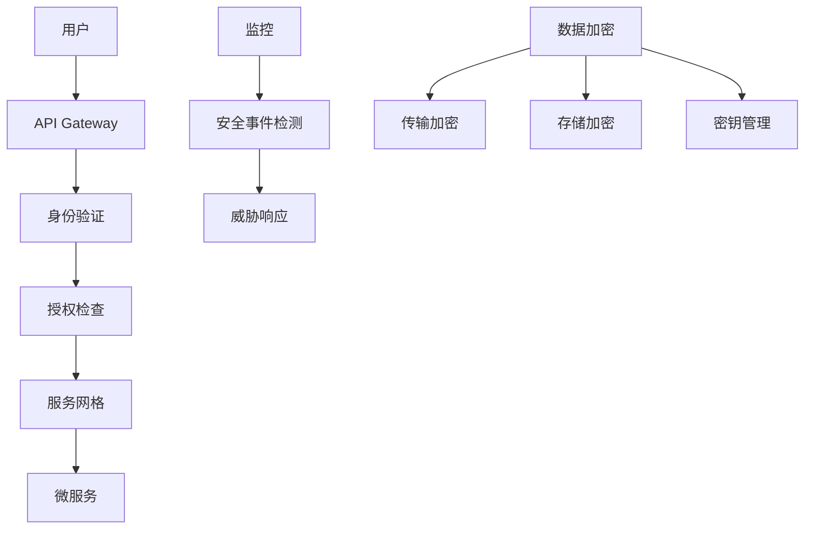

# Phase 3 安全性与隐私策略

**版本**: 1.0.0  
**日期**: 2025年9月27日  
**状态**: 草案  
**目标**: 制定处理生物识别数据的安全和隐私保护策略

## 概述

本文档定义了 Phase 3: Holistic Performance Hub 的安全性和隐私保护策略，重点关注：
- 生物识别数据（HRV、睡眠）的安全处理
- 第三方 OAuth 流程的安全实现
- 用户隐私权利的保护
- 合规性要求（GDPR、CCPA）

## 威胁模型分析

### 威胁分类

#### 1. 数据泄露威胁
- **内部威胁**: 恶意员工或承包商访问敏感数据
- **外部攻击**: 黑客攻击、SQL 注入、跨站脚本
- **供应链攻击**: 第三方库或服务的安全漏洞
- **物理威胁**: 服务器物理访问、设备丢失

#### 2. 身份认证威胁
- **OAuth 攻击**: 授权码拦截、令牌泄露
- **会话劫持**: Cookie 窃取、会话固定攻击
- **密码攻击**: 暴力破解、字典攻击
- **多因素认证绕过**: SIM 卡交换、社会工程

#### 3. 数据完整性威胁
- **数据篡改**: 恶意修改健康数据
- **数据注入**: 虚假数据注入
- **时间攻击**: 重放攻击、时间戳篡改
- **供应链攻击**: 恶意数据源

#### 4. 隐私威胁
- **数据关联**: 跨数据源的用户识别
- **数据挖掘**: 未授权的数据分析
- **数据出售**: 未经同意的数据商业化
- **监控**: 用户行为跟踪

## 安全架构设计

### 1. 零信任安全模型



#### 核心原则
- **永不信任，始终验证**: 所有请求都需要验证
- **最小权限**: 只授予必要的访问权限
- **深度防御**: 多层安全控制
- **持续监控**: 实时安全监控和响应

### 2. 身份认证和授权

#### OAuth 2.0 + PKCE 实现

```typescript
interface OAuthSecurityConfig {
  // PKCE 参数
  codeChallenge: string;
  codeChallengeMethod: 'S256';
  codeVerifier: string;
  
  // 安全配置
  state: string; // CSRF 保护
  nonce: string; // 重放攻击保护
  
  // 令牌配置
  accessTokenExpiry: number; // 15分钟
  refreshTokenExpiry: number; // 30天
  tokenRotation: boolean; // 启用令牌轮换
}

// OAuth 流程安全实现
class SecureOAuthFlow {
  async initiateAuth(vendor: string, userId: string): Promise<AuthInitiation> {
    // 生成 PKCE 参数
    const codeVerifier = this.generateCodeVerifier();
    const codeChallenge = await this.generateCodeChallenge(codeVerifier);
    
    // 生成状态和 nonce
    const state = this.generateSecureState();
    const nonce = this.generateNonce();
    
    // 存储安全参数
    await this.storeAuthParams(userId, vendor, {
      codeVerifier,
      state,
      nonce,
      expiresAt: Date.now() + 600000 // 10分钟过期
    });
    
    return {
      authUrl: this.buildAuthUrl(vendor, codeChallenge, state),
      state,
      nonce
    };
  }
  
  async handleCallback(
    vendor: string, 
    code: string, 
    state: string, 
    userId: string
  ): Promise<AuthResult> {
    // 验证状态参数
    const authParams = await this.getAuthParams(userId, vendor);
    if (!authParams || authParams.state !== state) {
      throw new SecurityError('Invalid state parameter');
    }
    
    // 验证 nonce
    if (!this.validateNonce(authParams.nonce)) {
      throw new SecurityError('Invalid nonce');
    }
    
    // 交换授权码
    const tokens = await this.exchangeCodeForTokens(
      vendor, 
      code, 
      authParams.codeVerifier
    );
    
    // 加密存储令牌
    const encryptedTokens = await this.encryptTokens(tokens);
    await this.storeEncryptedTokens(userId, vendor, encryptedTokens);
    
    // 清理临时参数
    await this.cleanupAuthParams(userId, vendor);
    
    return { success: true };
  }
}
```

#### JWT 令牌安全

```typescript
interface JWTSecurityConfig {
  algorithm: 'RS256'; // 使用 RSA 签名
  issuer: string;
  audience: string;
  expiration: number; // 15分钟
  clockTolerance: number; // 30秒
  
  // 令牌声明
  claims: {
    sub: string; // 用户ID
    iat: number; // 签发时间
    exp: number; // 过期时间
    jti: string; // 令牌ID
    scope: string[]; // 权限范围
  };
}

// 安全的 JWT 实现
class SecureJWTManager {
  async generateToken(userId: string, permissions: string[]): Promise<string> {
    const payload = {
      sub: userId,
      iat: Math.floor(Date.now() / 1000),
      exp: Math.floor(Date.now() / 1000) + 900, // 15分钟
      jti: this.generateTokenId(),
      scope: permissions
    };
    
    return jwt.sign(payload, this.privateKey, {
      algorithm: 'RS256',
      issuer: this.config.issuer,
      audience: this.config.audience
    });
  }
  
  async validateToken(token: string): Promise<TokenValidationResult> {
    try {
      const decoded = jwt.verify(token, this.publicKey, {
        algorithms: ['RS256'],
        issuer: this.config.issuer,
        audience: this.config.audience,
        clockTolerance: this.config.clockTolerance
      });
      
      // 检查令牌是否在黑名单中
      if (await this.isTokenBlacklisted(decoded.jti)) {
        throw new SecurityError('Token is blacklisted');
      }
      
      return { valid: true, payload: decoded };
    } catch (error) {
      return { valid: false, error: error.message };
    }
  }
}
```

### 3. 数据加密策略

#### 传输加密

```typescript
interface TransportSecurityConfig {
  // TLS 配置
  tlsVersion: '1.3';
  cipherSuites: string[];
  certificateValidation: boolean;
  
  // HSTS 配置
  hstsMaxAge: number; // 31536000 秒 (1年)
  includeSubDomains: boolean;
  
  // 证书固定
  certificatePinning: boolean;
  pinnedCertificates: string[];
}

// 安全的 HTTP 客户端
class SecureHTTPClient {
  private config: TransportSecurityConfig;
  
  async makeSecureRequest(url: string, options: RequestOptions): Promise<Response> {
    // 验证 TLS 证书
    if (!await this.validateCertificate(url)) {
      throw new SecurityError('Invalid certificate');
    }
    
    // 添加安全头
    const secureHeaders = {
      'Strict-Transport-Security': `max-age=${this.config.hstsMaxAge}`,
      'X-Content-Type-Options': 'nosniff',
      'X-Frame-Options': 'DENY',
      'X-XSS-Protection': '1; mode=block'
    };
    
    return this.httpClient.request(url, {
      ...options,
      headers: { ...options.headers, ...secureHeaders }
    });
  }
}
```

#### 存储加密

```typescript
interface StorageEncryptionConfig {
  algorithm: 'AES-256-GCM';
  keyDerivation: 'PBKDF2';
  keyDerivationIterations: number; // 100000
  saltLength: number; // 32 bytes
  ivLength: number; // 12 bytes
  tagLength: number; // 16 bytes
}

// 数据加密服务
class DataEncryptionService {
  private config: StorageEncryptionConfig;
  
  async encryptSensitiveData(data: any, userId: string): Promise<EncryptedData> {
    // 生成用户特定的密钥
    const userKey = await this.deriveUserKey(userId);
    
    // 生成随机 IV
    const iv = crypto.randomBytes(this.config.ivLength);
    
    // 加密数据
    const cipher = crypto.createCipherGCM(this.config.algorithm, userKey, iv);
    const encrypted = Buffer.concat([
      cipher.update(JSON.stringify(data), 'utf8'),
      cipher.final()
    ]);
    
    // 获取认证标签
    const tag = cipher.getAuthTag();
    
    return {
      encrypted: encrypted.toString('base64'),
      iv: iv.toString('base64'),
      tag: tag.toString('base64'),
      algorithm: this.config.algorithm
    };
  }
  
  async decryptSensitiveData(
    encryptedData: EncryptedData, 
    userId: string
  ): Promise<any> {
    // 获取用户密钥
    const userKey = await this.deriveUserKey(userId);
    
    // 解密数据
    const decipher = crypto.createDecipherGCM(
      encryptedData.algorithm, 
      userKey, 
      Buffer.from(encryptedData.iv, 'base64')
    );
    
    decipher.setAuthTag(Buffer.from(encryptedData.tag, 'base64'));
    
    const decrypted = Buffer.concat([
      decipher.update(Buffer.from(encryptedData.encrypted, 'base64')),
      decipher.final()
    ]);
    
    return JSON.parse(decrypted.toString('utf8'));
  }
}
```

### 4. 访问控制模型

#### 基于角色的访问控制 (RBAC)

```typescript
interface RoleDefinition {
  name: string;
  permissions: Permission[];
  dataAccess: DataAccessLevel;
}

interface Permission {
  resource: string;
  actions: string[];
  conditions?: AccessCondition[];
}

interface DataAccessLevel {
  hrv: 'none' | 'read' | 'write' | 'admin';
  sleep: 'none' | 'read' | 'write' | 'admin';
  insights: 'none' | 'read' | 'write' | 'admin';
  connections: 'none' | 'read' | 'write' | 'admin';
}

// 角色定义
const ROLES: Record<string, RoleDefinition> = {
  'athlete': {
    name: 'athlete',
    permissions: [
      { resource: 'own_hrv', actions: ['read'] },
      { resource: 'own_sleep', actions: ['read'] },
      { resource: 'own_insights', actions: ['read'] },
      { resource: 'own_connections', actions: ['read', 'write'] }
    ],
    dataAccess: {
      hrv: 'read',
      sleep: 'read',
      insights: 'read',
      connections: 'write'
    }
  },
  
  'coach': {
    name: 'coach',
    permissions: [
      { resource: 'athlete_hrv', actions: ['read'], conditions: ['athlete_consent'] },
      { resource: 'athlete_sleep', actions: ['read'], conditions: ['athlete_consent'] },
      { resource: 'athlete_insights', actions: ['read'], conditions: ['athlete_consent'] }
    ],
    dataAccess: {
      hrv: 'read',
      sleep: 'read',
      insights: 'read',
      connections: 'none'
    }
  },
  
  'admin': {
    name: 'admin',
    permissions: [
      { resource: '*', actions: ['*'] }
    ],
    dataAccess: {
      hrv: 'admin',
      sleep: 'admin',
      insights: 'admin',
      connections: 'admin'
    }
  }
};
```

#### 数据访问控制

```typescript
class DataAccessController {
  async checkDataAccess(
    userId: string, 
    resource: string, 
    action: string, 
    targetUserId?: string
  ): Promise<AccessDecision> {
    // 获取用户角色
    const userRoles = await this.getUserRoles(userId);
    
    // 检查权限
    for (const role of userRoles) {
      const roleDef = ROLES[role];
      if (this.hasPermission(roleDef, resource, action)) {
        // 检查数据访问条件
        if (await this.checkDataAccessConditions(
          userId, 
          targetUserId, 
          roleDef.permissions
        )) {
          return { allowed: true, role };
        }
      }
    }
    
    return { allowed: false, reason: 'Insufficient permissions' };
  }
  
  private async checkDataAccessConditions(
    userId: string, 
    targetUserId: string | undefined, 
    permissions: Permission[]
  ): Promise<boolean> {
    for (const permission of permissions) {
      if (permission.conditions) {
        for (const condition of permission.conditions) {
          if (!await this.evaluateCondition(condition, userId, targetUserId)) {
            return false;
          }
        }
      }
    }
    return true;
  }
}
```

## 隐私保护策略

### 1. 数据最小化原则

```typescript
interface DataMinimizationPolicy {
  // 数据收集原则
  collection: {
    purpose: string; // 明确收集目的
    necessity: boolean; // 数据必要性
    minimization: boolean; // 最小化收集
  };
  
  // 数据处理原则
  processing: {
    purpose: string; // 处理目的
    lawfulness: string; // 法律依据
    necessity: boolean; // 处理必要性
  };
  
  // 数据保留原则
  retention: {
    duration: number; // 保留期限
    purpose: string; // 保留目的
    deletion: boolean; // 自动删除
  };
}

// 数据最小化实现
class DataMinimizationService {
  async collectHRVData(userId: string, vendor: string): Promise<CollectedData> {
    // 只收集必要的 HRV 数据
    const minimalData = {
      userId,
      vendor,
      rmssd: true, // 必要
      ln_rmssd: true, // 必要
      resting_hr: true, // 必要
      device_type: false, // 非必要
      measurement_duration: false, // 非必要
      raw_data: false // 非必要
    };
    
    return this.extractMinimalData(vendor, minimalData);
  }
  
  async processSleepData(userId: string, rawData: any): Promise<ProcessedData> {
    // 只处理必要的睡眠数据
    const processedData = {
      userId,
      date: rawData.date,
      duration_min: rawData.duration_min,
      efficiency_pct: rawData.efficiency_pct,
      // 不处理敏感的个人信息
      bedtime: this.anonymizeTime(rawData.bedtime),
      wake_time: this.anonymizeTime(rawData.wake_time)
    };
    
    return processedData;
  }
}
```

### 2. 用户同意管理

```typescript
interface ConsentRecord {
  userId: string;
  dataType: 'hrv' | 'sleep' | 'insights' | 'connections';
  purpose: string;
  granted: boolean;
  grantedAt: string;
  revokedAt?: string;
  legalBasis: 'consent' | 'contract' | 'legitimate_interest';
  scope: string[];
  retentionPeriod: number;
}

// 同意管理服务
class ConsentManagementService {
  async recordConsent(
    userId: string, 
    dataType: string, 
    purpose: string, 
    granted: boolean
  ): Promise<ConsentRecord> {
    const consent: ConsentRecord = {
      userId,
      dataType,
      purpose,
      granted,
      grantedAt: new Date().toISOString(),
      legalBasis: 'consent',
      scope: this.getDefaultScope(dataType),
      retentionPeriod: this.getRetentionPeriod(dataType)
    };
    
    await this.storeConsent(consent);
    await this.auditLog.recordConsentChange(consent);
    
    return consent;
  }
  
  async revokeConsent(
    userId: string, 
    dataType: string, 
    purpose: string
  ): Promise<void> {
    const consent = await this.getConsent(userId, dataType, purpose);
    if (consent) {
      consent.revokedAt = new Date().toISOString();
      await this.updateConsent(consent);
      await this.auditLog.recordConsentRevocation(consent);
      
      // 触发数据删除
      await this.scheduleDataDeletion(userId, dataType);
    }
  }
  
  async checkConsent(
    userId: string, 
    dataType: string, 
    purpose: string
  ): Promise<boolean> {
    const consent = await this.getConsent(userId, dataType, purpose);
    return consent?.granted && !consent?.revokedAt;
  }
}
```

### 3. 数据主体权利实现

#### GDPR 数据主体权利

```typescript
interface DataSubjectRights {
  // 访问权 (Right of Access)
  access: {
    data: any;
    processing: ProcessingInfo[];
    recipients: string[];
    retention: RetentionInfo;
  };
  
  // 更正权 (Right to Rectification)
  rectification: {
    corrected: boolean;
    changes: DataChange[];
  };
  
  // 删除权 (Right to Erasure)
  erasure: {
    deleted: boolean;
    dataTypes: string[];
    retentionExceptions: string[];
  };
  
  // 限制处理权 (Right to Restriction)
  restriction: {
    restricted: boolean;
    dataTypes: string[];
    reason: string;
  };
  
  // 数据可携带权 (Right to Data Portability)
  portability: {
    exported: boolean;
    format: 'json' | 'csv' | 'xml';
    data: any;
  };
  
  // 反对权 (Right to Object)
  objection: {
    objected: boolean;
    dataTypes: string[];
    reason: string;
  };
}

// 数据主体权利服务
class DataSubjectRightsService {
  async handleAccessRequest(userId: string): Promise<DataSubjectRights['access']> {
    // 收集所有用户数据
    const userData = await this.collectAllUserData(userId);
    
    // 收集处理信息
    const processingInfo = await this.getProcessingInfo(userId);
    
    // 收集数据接收者
    const recipients = await this.getDataRecipients(userId);
    
    // 收集保留信息
    const retentionInfo = await this.getRetentionInfo(userId);
    
    return {
      data: userData,
      processing: processingInfo,
      recipients,
      retention: retentionInfo
    };
  }
  
  async handleErasureRequest(userId: string): Promise<DataSubjectRights['erasure']> {
    const dataTypes = ['hrv', 'sleep', 'insights', 'connections'];
    const deletedTypes: string[] = [];
    const retentionExceptions: string[] = [];
    
    for (const dataType of dataTypes) {
      try {
        // 检查是否有法律保留要求
        if (await this.hasLegalRetentionRequirement(userId, dataType)) {
          retentionExceptions.push(dataType);
          continue;
        }
        
        // 删除数据
        await this.deleteUserData(userId, dataType);
        deletedTypes.push(dataType);
        
        // 记录删除操作
        await this.auditLog.recordDataDeletion(userId, dataType);
      } catch (error) {
        console.error(`Failed to delete ${dataType} for user ${userId}:`, error);
      }
    }
    
    return {
      deleted: deletedTypes.length > 0,
      dataTypes: deletedTypes,
      retentionExceptions
    };
  }
  
  async handlePortabilityRequest(userId: string): Promise<DataSubjectRights['portability']> {
    // 收集可携带的数据
    const portableData = await this.collectPortableData(userId);
    
    // 导出为 JSON 格式
    const exportedData = {
      userId,
      exportDate: new Date().toISOString(),
      data: portableData,
      format: 'json',
      version: '1.0'
    };
    
    return {
      exported: true,
      format: 'json',
      data: exportedData
    };
  }
}
```

## 审计和监控

### 1. 安全事件监控

```typescript
interface SecurityEvent {
  id: string;
  timestamp: string;
  type: 'authentication' | 'authorization' | 'data_access' | 'data_modification';
  severity: 'low' | 'medium' | 'high' | 'critical';
  userId?: string;
  ipAddress: string;
  userAgent: string;
  resource: string;
  action: string;
  result: 'success' | 'failure' | 'blocked';
  details: any;
}

// 安全监控服务
class SecurityMonitoringService {
  async logSecurityEvent(event: SecurityEvent): Promise<void> {
    // 存储事件
    await this.storeSecurityEvent(event);
    
    // 实时分析
    await this.analyzeSecurityEvent(event);
    
    // 触发警报
    if (this.shouldTriggerAlert(event)) {
      await this.triggerSecurityAlert(event);
    }
  }
  
  private async analyzeSecurityEvent(event: SecurityEvent): Promise<void> {
    // 检测异常模式
    const anomalies = await this.detectAnomalies(event);
    
    // 检测攻击模式
    const attacks = await this.detectAttacks(event);
    
    // 更新风险评分
    await this.updateRiskScore(event.userId, event);
  }
  
  private shouldTriggerAlert(event: SecurityEvent): boolean {
    // 高风险事件
    if (event.severity === 'critical') return true;
    
    // 多次失败尝试
    if (event.result === 'failure' && await this.hasMultipleFailures(event)) {
      return true;
    }
    
    // 异常访问模式
    if (await this.isAbnormalAccessPattern(event)) {
      return true;
    }
    
    return false;
  }
}
```

### 2. 数据访问审计

```typescript
interface DataAccessAudit {
  id: string;
  timestamp: string;
  userId: string;
  resource: string;
  action: string;
  dataType: string;
  targetUserId?: string;
  ipAddress: string;
  userAgent: string;
  result: 'success' | 'failure' | 'blocked';
  reason?: string;
  dataAccessed?: any;
}

// 数据访问审计服务
class DataAccessAuditService {
  async auditDataAccess(
    userId: string, 
    resource: string, 
    action: string, 
    dataType: string,
    targetUserId?: string
  ): Promise<void> {
    const audit: DataAccessAudit = {
      id: this.generateAuditId(),
      timestamp: new Date().toISOString(),
      userId,
      resource,
      action,
      dataType,
      targetUserId,
      ipAddress: this.getClientIP(),
      userAgent: this.getUserAgent(),
      result: 'success'
    };
    
    await this.storeAuditRecord(audit);
    
    // 检查访问模式
    await this.analyzeAccessPattern(audit);
  }
  
  async generateAccessReport(
    userId: string, 
    fromDate: string, 
    toDate: string
  ): Promise<AccessReport> {
    const audits = await this.getAuditRecords(userId, fromDate, toDate);
    
    return {
      userId,
      period: { fromDate, toDate },
      totalAccess: audits.length,
      dataTypes: this.aggregateByDataType(audits),
      resources: this.aggregateByResource(audits),
      patterns: this.analyzeAccessPatterns(audits)
    };
  }
}
```

## 合规性要求

### 1. GDPR 合规检查清单

```typescript
interface GDPRComplianceChecklist {
  // 法律依据
  legalBasis: {
    consent: boolean; // 用户明确同意
    contract: boolean; // 合同履行
    legitimateInterest: boolean; // 合法利益
    legalObligation: boolean; // 法律义务
  };
  
  // 数据保护原则
  dataProtectionPrinciples: {
    lawfulness: boolean; // 合法性
    fairness: boolean; // 公平性
    transparency: boolean; // 透明度
    purposeLimitation: boolean; // 目的限制
    dataMinimization: boolean; // 数据最小化
    accuracy: boolean; // 准确性
    storageLimitation: boolean; // 存储限制
    integrity: boolean; // 完整性
    confidentiality: boolean; // 保密性
  };
  
  // 数据主体权利
  dataSubjectRights: {
    access: boolean; // 访问权
    rectification: boolean; // 更正权
    erasure: boolean; // 删除权
    restriction: boolean; // 限制处理权
    portability: boolean; // 数据可携带权
    objection: boolean; // 反对权
  };
  
  // 技术措施
  technicalMeasures: {
    encryption: boolean; // 加密
    accessControl: boolean; // 访问控制
    auditLogging: boolean; // 审计日志
    dataBackup: boolean; // 数据备份
    incidentResponse: boolean; // 事件响应
  };
}
```

### 2. CCPA 合规检查清单

```typescript
interface CCPAComplianceChecklist {
  // 消费者权利
  consumerRights: {
    rightToKnow: boolean; // 知情权
    rightToDelete: boolean; // 删除权
    rightToOptOut: boolean; // 选择退出权
    rightToNonDiscrimination: boolean; // 非歧视权
  };
  
  // 数据分类
  dataClassification: {
    personalInformation: boolean; // 个人信息
    sensitivePersonalInformation: boolean; // 敏感个人信息
    biometricInformation: boolean; // 生物识别信息
  };
  
  // 通知要求
  noticeRequirements: {
    privacyNotice: boolean; // 隐私通知
    dataCollectionNotice: boolean; // 数据收集通知
    optOutNotice: boolean; // 选择退出通知
  };
  
  // 技术措施
  technicalMeasures: {
    dataInventory: boolean; // 数据清单
    accessControls: boolean; // 访问控制
    encryption: boolean; // 加密
    auditTrail: boolean; // 审计轨迹
  };
}
```

## 事件响应计划

### 1. 安全事件分类

```typescript
interface SecurityIncident {
  id: string;
  severity: 'low' | 'medium' | 'high' | 'critical';
  type: 'data_breach' | 'unauthorized_access' | 'malware' | 'ddos' | 'insider_threat';
  description: string;
  detectedAt: string;
  reportedBy: string;
  affectedUsers: number;
  affectedData: string[];
  status: 'detected' | 'investigating' | 'contained' | 'resolved' | 'closed';
  timeline: IncidentTimeline[];
}

interface IncidentTimeline {
  timestamp: string;
  action: string;
  actor: string;
  details: string;
}
```

### 2. 事件响应流程

```typescript
class IncidentResponseService {
  async handleSecurityIncident(incident: SecurityIncident): Promise<void> {
    // 1. 立即响应
    await this.immediateResponse(incident);
    
    // 2. 调查分析
    await this.investigateIncident(incident);
    
    // 3. 遏制影响
    await this.containIncident(incident);
    
    // 4. 恢复服务
    await this.recoverFromIncident(incident);
    
    // 5. 事后分析
    await this.postIncidentAnalysis(incident);
  }
  
  private async immediateResponse(incident: SecurityIncident): Promise<void> {
    // 通知安全团队
    await this.notifySecurityTeam(incident);
    
    // 启动事件响应团队
    await this.activateResponseTeam(incident);
    
    // 记录事件
    await this.logIncident(incident);
  }
  
  private async investigateIncident(incident: SecurityIncident): Promise<void> {
    // 收集证据
    await this.collectEvidence(incident);
    
    // 分析影响
    await this.analyzeImpact(incident);
    
    // 确定根本原因
    await this.determineRootCause(incident);
  }
}
```

## 安全测试策略

### 1. 渗透测试计划

```typescript
interface PenetrationTestPlan {
  scope: {
    applications: string[];
    networks: string[];
    systems: string[];
  };
  
  methodology: {
    reconnaissance: boolean;
    vulnerabilityScanning: boolean;
    exploitation: boolean;
    postExploitation: boolean;
    reporting: boolean;
  };
  
  tools: string[];
  timeline: {
    startDate: string;
    endDate: string;
    milestones: string[];
  };
}
```

### 2. 安全代码审查

```typescript
interface SecurityCodeReview {
  checklist: {
    inputValidation: boolean;
    outputEncoding: boolean;
    authentication: boolean;
    authorization: boolean;
    sessionManagement: boolean;
    cryptography: boolean;
    errorHandling: boolean;
    logging: boolean;
  };
  
  tools: {
    staticAnalysis: string[];
    dynamicAnalysis: string[];
    dependencyScanning: string[];
  };
}
```

---

**注意**: 此安全性和隐私策略将在架构设计工作坊中进一步细化和验证。所有安全措施都需要经过安全测试和合规性审查。
