# Phase 3 数据模型设计

**版本**: 1.0.0  
**日期**: 2025年9月27日  
**状态**: 草案  
**目标**: 设计 HRV、睡眠和 Readiness 相关的数据模型

## 概述

本文档定义了 Phase 3: Holistic Performance Hub 的核心数据模型，包括：
- HRV 数据模型 (`hrv_daily`)
- 睡眠数据模型 (`sleep_daily`)
- Readiness 计算模型 (`readiness_snapshots`)
- 连接管理模型 (`vendor_connections`)
- 洞察和推荐模型 (`insights`)

## 数据库 Schema 设计

### 1. HRV 数据表 (hrv_daily)

```sql
CREATE TABLE hrv_daily (
    id UUID PRIMARY KEY DEFAULT gen_random_uuid(),
    user_id VARCHAR(255) NOT NULL,
    date DATE NOT NULL,
    
    -- HRV 核心指标
    rmssd DECIMAL(8,2), -- Root Mean Square of Successive Differences
    ln_rmssd DECIMAL(8,4), -- Natural log of rMSSD
    resting_hr INTEGER, -- Resting Heart Rate (BPM)
    
    -- 数据来源
    vendor VARCHAR(50) NOT NULL, -- 'oura', 'whoop', 'apple_health', 'google_fit'
    connection_id VARCHAR(255) NOT NULL,
    
    -- 数据质量
    data_quality VARCHAR(20) DEFAULT 'medium' CHECK (data_quality IN ('high', 'medium', 'low')),
    confidence_score DECIMAL(3,2) DEFAULT 0.5 CHECK (confidence_score >= 0 AND confidence_score <= 1),
    
    -- 测量上下文
    measurement_duration INTEGER, -- 测量时长（分钟）
    device_type VARCHAR(100), -- 设备类型
    measurement_time TIME, -- 测量时间
    
    -- 原始数据（JSON）
    raw_data JSONB,
    
    -- 元数据
    captured_at TIMESTAMP WITH TIME ZONE NOT NULL DEFAULT NOW(),
    processed_at TIMESTAMP WITH TIME ZONE,
    created_at TIMESTAMP WITH TIME ZONE DEFAULT NOW(),
    updated_at TIMESTAMP WITH TIME ZONE DEFAULT NOW(),
    
    -- 约束
    CONSTRAINT unique_user_date_vendor UNIQUE (user_id, date, vendor),
    CONSTRAINT valid_rmssd CHECK (rmssd IS NULL OR rmssd > 0),
    CONSTRAINT valid_resting_hr CHECK (resting_hr IS NULL OR (resting_hr >= 30 AND resting_hr <= 200))
);

-- 索引
CREATE INDEX idx_hrv_daily_user_date ON hrv_daily (user_id, date DESC);
CREATE INDEX idx_hrv_daily_vendor ON hrv_daily (vendor);
CREATE INDEX idx_hrv_daily_data_quality ON hrv_daily (data_quality);
CREATE INDEX idx_hrv_daily_captured_at ON hrv_daily (captured_at);

-- 分区表（按日期）
CREATE TABLE hrv_daily_y2025 PARTITION OF hrv_daily
    FOR VALUES FROM ('2025-01-01') TO ('2026-01-01');
```

### 2. 睡眠数据表 (sleep_daily)

```sql
CREATE TABLE sleep_daily (
    id UUID PRIMARY KEY DEFAULT gen_random_uuid(),
    user_id VARCHAR(255) NOT NULL,
    date DATE NOT NULL,
    
    -- 睡眠核心指标
    duration_min INTEGER NOT NULL, -- 总睡眠时长（分钟）
    efficiency_pct DECIMAL(5,2), -- 睡眠效率（百分比）
    latency_min INTEGER, -- 入睡潜伏期（分钟）
    wake_count INTEGER, -- 夜间觉醒次数
    
    -- 睡眠阶段（分钟）
    light_sleep_min INTEGER,
    deep_sleep_min INTEGER,
    rem_sleep_min INTEGER,
    awake_min INTEGER,
    
    -- 数据来源
    vendor VARCHAR(50) NOT NULL,
    connection_id VARCHAR(255) NOT NULL,
    
    -- 数据质量
    data_quality VARCHAR(20) DEFAULT 'medium' CHECK (data_quality IN ('high', 'medium', 'low')),
    confidence_score DECIMAL(3,2) DEFAULT 0.5 CHECK (confidence_score >= 0 AND confidence_score <= 1),
    
    -- 睡眠时间
    bedtime TIME,
    wake_time TIME,
    sleep_start TIMESTAMP WITH TIME ZONE,
    sleep_end TIMESTAMP WITH TIME ZONE,
    
    -- 原始数据（JSON）
    raw_data JSONB,
    
    -- 元数据
    captured_at TIMESTAMP WITH TIME ZONE NOT NULL DEFAULT NOW(),
    processed_at TIMESTAMP WITH TIME ZONE,
    created_at TIMESTAMP WITH TIME ZONE DEFAULT NOW(),
    updated_at TIMESTAMP WITH TIME ZONE DEFAULT NOW(),
    
    -- 约束
    CONSTRAINT unique_user_date_vendor UNIQUE (user_id, date, vendor),
    CONSTRAINT valid_duration CHECK (duration_min > 0 AND duration_min <= 1440), -- 最多24小时
    CONSTRAINT valid_efficiency CHECK (efficiency_pct IS NULL OR (efficiency_pct >= 0 AND efficiency_pct <= 100)),
    CONSTRAINT valid_latency CHECK (latency_min IS NULL OR latency_min >= 0),
    CONSTRAINT valid_wake_count CHECK (wake_count IS NULL OR wake_count >= 0)
);

-- 索引
CREATE INDEX idx_sleep_daily_user_date ON sleep_daily (user_id, date DESC);
CREATE INDEX idx_sleep_daily_vendor ON sleep_daily (vendor);
CREATE INDEX idx_sleep_daily_data_quality ON sleep_daily (data_quality);
CREATE INDEX idx_sleep_daily_captured_at ON sleep_daily (captured_at);

-- 分区表（按日期）
CREATE TABLE sleep_daily_y2025 PARTITION OF sleep_daily
    FOR VALUES FROM ('2025-01-01') TO ('2026-01-01');
```

### 3. Readiness 快照表 (readiness_snapshots)

```sql
CREATE TABLE readiness_snapshots (
    id UUID PRIMARY KEY DEFAULT gen_random_uuid(),
    user_id VARCHAR(255) NOT NULL,
    date DATE NOT NULL,
    
    -- Readiness 评分
    readiness_score INTEGER NOT NULL CHECK (readiness_score >= 0 AND readiness_score <= 100),
    readiness_level VARCHAR(20) NOT NULL CHECK (readiness_level IN ('low', 'moderate', 'high')),
    
    -- 评分组成
    hrv_component DECIMAL(5,2), -- HRV 贡献分数
    sleep_component DECIMAL(5,2), -- 睡眠贡献分数
    fatigue_component DECIMAL(5,2), -- 疲劳贡献分数
    training_load_component DECIMAL(5,2), -- 训练负荷贡献分数
    
    -- 置信度
    confidence_score DECIMAL(3,2) NOT NULL CHECK (confidence_score >= 0 AND confidence_score <= 1),
    
    -- 数据可用性
    hrv_available BOOLEAN DEFAULT FALSE,
    sleep_available BOOLEAN DEFAULT FALSE,
    fatigue_available BOOLEAN DEFAULT FALSE,
    training_load_available BOOLEAN DEFAULT FALSE,
    
    -- 影响因素
    drivers JSONB, -- 详细的影响因素分析
    
    -- 推荐
    recommendations JSONB, -- 个性化推荐
    
    -- 元数据
    calculated_at TIMESTAMP WITH TIME ZONE NOT NULL DEFAULT NOW(),
    created_at TIMESTAMP WITH TIME ZONE DEFAULT NOW(),
    updated_at TIMESTAMP WITH TIME ZONE DEFAULT NOW(),
    
    -- 约束
    CONSTRAINT unique_user_date UNIQUE (user_id, date)
);

-- 索引
CREATE INDEX idx_readiness_user_date ON readiness_snapshots (user_id, date DESC);
CREATE INDEX idx_readiness_score ON readiness_snapshots (readiness_score);
CREATE INDEX idx_readiness_level ON readiness_snapshots (readiness_level);
CREATE INDEX idx_readiness_calculated_at ON readiness_snapshots (calculated_at);

-- 分区表（按日期）
CREATE TABLE readiness_snapshots_y2025 PARTITION OF readiness_snapshots
    FOR VALUES FROM ('2025-01-01') TO ('2026-01-01');
```

### 4. 供应商连接表 (vendor_connections)

```sql
CREATE TABLE vendor_connections (
    id UUID PRIMARY KEY DEFAULT gen_random_uuid(),
    user_id VARCHAR(255) NOT NULL,
    vendor VARCHAR(50) NOT NULL,
    
    -- 连接状态
    status VARCHAR(20) NOT NULL DEFAULT 'pending' CHECK (status IN ('pending', 'active', 'expired', 'revoked', 'failed')),
    
    -- OAuth 信息
    access_token_encrypted TEXT, -- 加密的访问令牌
    refresh_token_encrypted TEXT, -- 加密的刷新令牌
    token_expires_at TIMESTAMP WITH TIME ZONE,
    scope TEXT[], -- 授权范围
    
    -- 权限
    permissions JSONB, -- 用户授权的数据权限
    
    -- 同步状态
    last_sync_at TIMESTAMP WITH TIME ZONE,
    last_sync_status VARCHAR(20) CHECK (last_sync_status IN ('success', 'failed', 'partial')),
    sync_frequency_hours INTEGER DEFAULT 24,
    
    -- 元数据
    created_at TIMESTAMP WITH TIME ZONE DEFAULT NOW(),
    updated_at TIMESTAMP WITH TIME ZONE DEFAULT NOW(),
    revoked_at TIMESTAMP WITH TIME ZONE,
    
    -- 约束
    CONSTRAINT unique_user_vendor UNIQUE (user_id, vendor)
);

-- 索引
CREATE INDEX idx_vendor_connections_user ON vendor_connections (user_id);
CREATE INDEX idx_vendor_connections_vendor ON vendor_connections (vendor);
CREATE INDEX idx_vendor_connections_status ON vendor_connections (status);
CREATE INDEX idx_vendor_connections_last_sync ON vendor_connections (last_sync_at);
```

### 5. 洞察表 (insights)

```sql
CREATE TABLE insights (
    id UUID PRIMARY KEY DEFAULT gen_random_uuid(),
    user_id VARCHAR(255) NOT NULL,
    date DATE NOT NULL,
    
    -- 洞察类型
    insight_type VARCHAR(50) NOT NULL CHECK (insight_type IN (
        'performance', 'recovery', 'consistency', 'anomaly', 
        'trend', 'recommendation', 'alert'
    )),
    
    -- 洞察内容
    title VARCHAR(255) NOT NULL,
    description TEXT NOT NULL,
    impact_level VARCHAR(20) NOT NULL CHECK (impact_level IN ('high', 'medium', 'low')),
    
    -- 可操作性
    actionable BOOLEAN DEFAULT FALSE,
    recommendations JSONB, -- 具体建议
    
    -- 数据支持
    supporting_data JSONB, -- 支持洞察的数据
    confidence_score DECIMAL(3,2) CHECK (confidence_score >= 0 AND confidence_score <= 1),
    
    -- 状态
    status VARCHAR(20) DEFAULT 'active' CHECK (status IN ('active', 'dismissed', 'archived')),
    viewed_at TIMESTAMP WITH TIME ZONE,
    dismissed_at TIMESTAMP WITH TIME ZONE,
    
    -- 元数据
    generated_at TIMESTAMP WITH TIME ZONE NOT NULL DEFAULT NOW(),
    created_at TIMESTAMP WITH TIME ZONE DEFAULT NOW(),
    updated_at TIMESTAMP WITH TIME ZONE DEFAULT NOW(),
    
    -- 约束
    CONSTRAINT unique_user_date_type UNIQUE (user_id, date, insight_type)
);

-- 索引
CREATE INDEX idx_insights_user_date ON insights (user_id, date DESC);
CREATE INDEX idx_insights_type ON insights (insight_type);
CREATE INDEX idx_insights_impact ON insights (impact_level);
CREATE INDEX idx_insights_status ON insights (status);
CREATE INDEX idx_insights_actionable ON insights (actionable);
```

## 数据关系图

```mermaid
erDiagram
    vendor_connections ||--o{ hrv_daily : "provides"
    vendor_connections ||--o{ sleep_daily : "provides"
    
    hrv_daily ||--o{ readiness_snapshots : "contributes to"
    sleep_daily ||--o{ readiness_snapshots : "contributes to"
    
    readiness_snapshots ||--o{ insights : "generates"
    
    vendor_connections {
        uuid id PK
        string user_id
        string vendor
        string status
        text access_token_encrypted
        text refresh_token_encrypted
        timestamp token_expires_at
        text_array scope
        jsonb permissions
        timestamp last_sync_at
        string last_sync_status
        integer sync_frequency_hours
        timestamp created_at
        timestamp updated_at
        timestamp revoked_at
    }
    
    hrv_daily {
        uuid id PK
        string user_id
        date date
        decimal rmssd
        decimal ln_rmssd
        integer resting_hr
        string vendor
        string connection_id
        string data_quality
        decimal confidence_score
        integer measurement_duration
        string device_type
        time measurement_time
        jsonb raw_data
        timestamp captured_at
        timestamp processed_at
        timestamp created_at
        timestamp updated_at
    }
    
    sleep_daily {
        uuid id PK
        string user_id
        date date
        integer duration_min
        decimal efficiency_pct
        integer latency_min
        integer wake_count
        integer light_sleep_min
        integer deep_sleep_min
        integer rem_sleep_min
        integer awake_min
        string vendor
        string connection_id
        string data_quality
        decimal confidence_score
        time bedtime
        time wake_time
        timestamp sleep_start
        timestamp sleep_end
        jsonb raw_data
        timestamp captured_at
        timestamp processed_at
        timestamp created_at
        timestamp updated_at
    }
    
    readiness_snapshots {
        uuid id PK
        string user_id
        date date
        integer readiness_score
        string readiness_level
        decimal hrv_component
        decimal sleep_component
        decimal fatigue_component
        decimal training_load_component
        decimal confidence_score
        boolean hrv_available
        boolean sleep_available
        boolean fatigue_available
        boolean training_load_available
        jsonb drivers
        jsonb recommendations
        timestamp calculated_at
        timestamp created_at
        timestamp updated_at
    }
    
    insights {
        uuid id PK
        string user_id
        date date
        string insight_type
        string title
        text description
        string impact_level
        boolean actionable
        jsonb recommendations
        jsonb supporting_data
        decimal confidence_score
        string status
        timestamp viewed_at
        timestamp dismissed_at
        timestamp generated_at
        timestamp created_at
        timestamp updated_at
    }
```



## Readiness 计算模型

### 算法设计

```typescript
interface ReadinessCalculationModel {
  // 基础评分范围：0-100
  baseScore: number;
  
  // 各组件权重
  weights: {
    hrv: number;        // 0.4 (40%)
    sleep: number;      // 0.3 (30%)
    fatigue: number;    // 0.2 (20%)
    trainingLoad: number; // 0.1 (10%)
  };
  
  // 组件计算函数
  components: {
    hrv: (data: HRVData) => number;
    sleep: (data: SleepData) => number;
    fatigue: (data: FatigueData) => number;
    trainingLoad: (data: TrainingData) => number;
  };
  
  // 置信度计算
  confidence: (dataAvailability: DataAvailability) => number;
}

// HRV 组件计算
function calculateHRVComponent(hrvData: HRVData): number {
  if (!hrvData.ln_rmssd) return 50; // 默认中等分数
  
  // 基于 lnRMSSD 的标准化评分
  // 参考范围：lnRMSSD 3.5-4.5 为正常范围
  const normalizedScore = Math.max(0, Math.min(100, 
    ((hrvData.ln_rmssd - 3.0) / (5.0 - 3.0)) * 100
  ));
  
  // 考虑数据质量
  const qualityMultiplier = {
    'high': 1.0,
    'medium': 0.9,
    'low': 0.7
  }[hrvData.data_quality] || 0.7;
  
  return normalizedScore * qualityMultiplier;
}

// 睡眠组件计算
function calculateSleepComponent(sleepData: SleepData): number {
  let score = 50; // 基础分数
  
  // 睡眠时长评分 (7-9小时为最佳)
  const durationScore = Math.max(0, Math.min(100,
    100 - Math.abs(sleepData.duration_min - 480) * 0.5 // 480分钟 = 8小时
  ));
  
  // 睡眠效率评分
  const efficiencyScore = sleepData.efficiency_pct || 75;
  
  // 综合评分
  score = (durationScore * 0.6 + efficiencyScore * 0.4);
  
  // 考虑数据质量
  const qualityMultiplier = {
    'high': 1.0,
    'medium': 0.9,
    'low': 0.7
  }[sleepData.data_quality] || 0.7;
  
  return score * qualityMultiplier;
}
```

## 数据质量保证

### 数据验证规则

```typescript
interface DataValidationRules {
  hrv: {
    rmssd: { min: 5, max: 200 };
    ln_rmssd: { min: 1.5, max: 6.0 };
    resting_hr: { min: 30, max: 200 };
  };
  
  sleep: {
    duration_min: { min: 60, max: 1440 }; // 1小时到24小时
    efficiency_pct: { min: 0, max: 100 };
    latency_min: { min: 0, max: 180 }; // 最多3小时入睡
    wake_count: { min: 0, max: 50 };
  };
}

// 数据质量评估
function assessDataQuality(data: any, type: 'hrv' | 'sleep'): 'high' | 'medium' | 'low' {
  const rules = DataValidationRules[type];
  let qualityScore = 0;
  let totalChecks = 0;
  
  for (const [field, rule] of Object.entries(rules)) {
    if (data[field] !== undefined && data[field] !== null) {
      totalChecks++;
      if (data[field] >= rule.min && data[field] <= rule.max) {
        qualityScore++;
      }
    }
  }
  
  const qualityRatio = qualityScore / totalChecks;
  
  if (qualityRatio >= 0.9) return 'high';
  if (qualityRatio >= 0.7) return 'medium';
  return 'low';
}
```

## 数据迁移策略

### 从现有系统迁移

1. **用户数据迁移**
   - 保持现有用户 ID 不变
   - 迁移用户偏好设置
   - 保留历史训练数据

2. **数据标准化**
   - 将现有疲劳数据映射到新模型
   - 标准化训练负荷计算
   - 建立数据质量基线

3. **渐进式部署**
   - 新功能与现有系统并行运行
   - 逐步迁移用户到新系统
   - 保持数据一致性

## 性能优化

### 索引策略

- **时间序列查询**: 按用户和日期建立复合索引
- **供应商查询**: 按供应商建立索引
- **数据质量查询**: 按数据质量建立索引

### 分区策略

- **按年份分区**: 提高查询性能
- **按用户分区**: 支持大规模用户
- **自动清理**: 定期清理过期数据

### 缓存策略

- **Readiness 缓存**: 缓存最近7天的 readiness 数据
- **用户连接缓存**: 缓存活跃连接状态
- **洞察缓存**: 缓存生成的洞察结果

---

**注意**: 此数据模型设计将在架构设计工作坊中进一步细化和验证。所有表结构都需要经过性能测试和安全审查。
