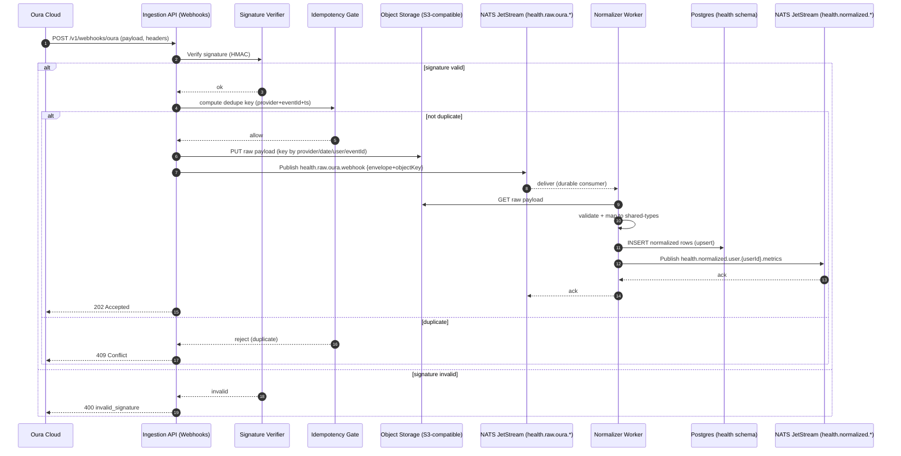
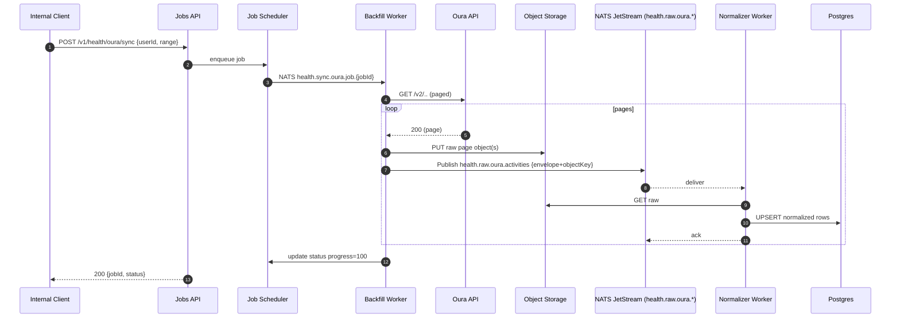
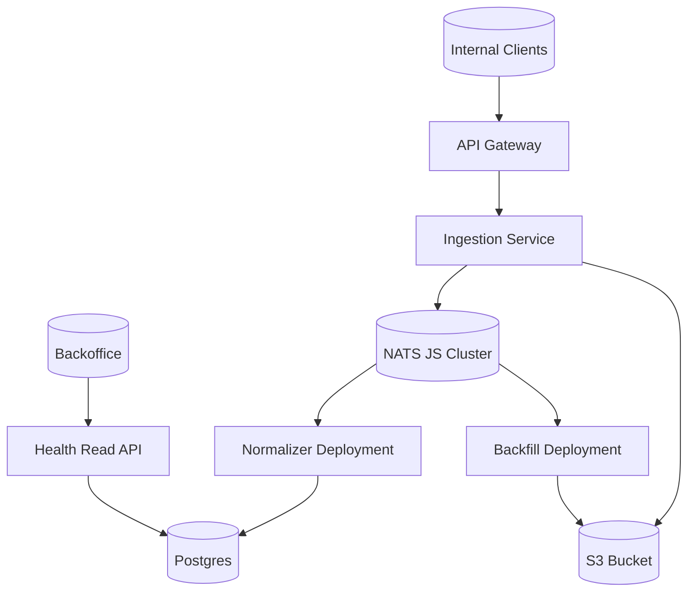

# Phase 3: Health Integrations Architecture (Draft)

Status: Draft
Owner: Platform Eng
Last Updated: 2025-09-27

## 1. Overview
- Purpose: Introduce provider integrations for health data starting with Oura. Provide a secure, observable ingestion and normalization pipeline with REST v1 APIs.
- First provider: Oura (PoC scope). Additional providers later as parallel workstreams.
- Principles: Architecture First, least privilege, privacy by design, typed contracts with single source of truth in `@athlete-ally/shared-types`.

## 2. Scope and Goals
- In-scope: Oura webhook ingestion and backfill, eventing via NATS JetStream, raw payload storage (S3 compatible), normalized storage (Postgres), public REST v1 read APIs, internal job orchestration.
- Out-of-scope: Advanced analytics/OLAP (evaluate later), cross-provider harmonization beyond the canonical types already present, real-time streaming to UI.
- Non-goals (phase 3): Full self-serve provider onboarding UI, multi-tenant externalization.

## 3. Decisions (Confirmed)
- Providers: Oura first.
- Event bus: NATS JetStream. Subject naming approved (see Appendix A).
- Storage: S3-compatible for raw payloads; Postgres for normalized store.
- API style: REST + JSON v1.
- Schemas: `@athlete-ally/shared-types` is the source of truth; docs reference those types.
- Docs structure: `docs/phase-3/` with `api/` and `schemas/` subfolders.

## 4. High-Level Architecture
- Ingestion
  - Webhook endpoint for Oura delivers raw payloads.
  - Signature verification and idempotency gate.
  - Raw event persisted to object storage and published to event bus.
- Processing
  - Normalization worker consumes raw subjects, validates against `shared-types`, enriches, and writes normalized rows to Postgres.
  - Backfill/sync worker pulls historical ranges using provider token, paging and respecting rate limits.
- Serving
  - REST v1 read APIs expose normalized views by user/time range.
  - Job APIs trigger backfills and report status.
- Observability
  - OpenTelemetry traces, metrics, and structured logs at each hop.

## 5. Event Bus (NATS JetStream)
- Streams
  - health.raw.oura.* (raw ingestion)
  - health.normalized.* (post-normalization)
  - health.sync.* (job orchestration)
- Subjects (examples)
  - health.raw.oura.webhook
  - health.raw.oura.activities
  - health.normalized.user.{userId}.metrics
  - health.sync.oura.job.{jobId}.status
- Payloads
  - Raw payloads: opaque provider JSON + minimal envelope (provider, receivedAt, signature metadata, dedupe key).
  - Normalized payloads: typed DTOs from `@athlete-ally/shared-types`.
- Delivery and durability
  - At least once with idempotent consumers; durable consumers per service; explicit replay strategy.

## 6. Storage
- Object storage (S3 compatible)
  - Bucket: `health-integrations-raw`
  - Key layout: `provider=oura/date=YYYY-MM-DD/user={userId}/event={eventId}.json`
  - Server-side encryption enabled; lifecycle policy for retention (see Security & Privacy).
- Postgres (normalized)
  - Schema: `health`
  - Tables (initial)
    - `raw_events_index` (event_id, provider, user_id, received_at, object_key, sha256, unique on provider+event_id)
    - `oura_daily_readiness` (user_id, date, score, ...)
    - `oura_activities` (user_id, start, end, type, metrics jsonb, ...)
    - `ingestion_jobs` (job_id, user_id, provider, status, progress, started_at, updated_at, last_error)
  - Consider hypertables or partitioning by date for large volumes later.

## 7. REST v1 API (initial)
- Webhooks (internal)
  - POST `/v1/webhooks/oura` 200/202 on accept; validates signature and schedules processing.
- Jobs (internal)
  - POST `/v1/health/oura/sync` body: userId, range; returns jobId.
  - GET `/v1/health/oura/sync/{jobId}` returns job status.
- Reads (public/internal as per access policy)
  - GET `/v1/health/{userId}/oura/daily?start=YYYY-MM-DD&end=YYYY-MM-DD`
  - GET `/v1/health/{userId}/oura/activities?start=...&end=...`
- Contracts: request/response DTOs reference `@athlete-ally/shared-types` (see `docs/phase-3/api/` and `docs/phase-3/schemas/`).

## 8. Security & Privacy Strategy
- Data classification and minimization
  - Treat Oura data as sensitive health-related; store only required fields; drop PII not needed.
- Transport security
  - HTTPS/TLS for all incoming and outgoing traffic; strict TLS settings; webhook signature verification.
- At-rest encryption
  - S3 server-side encryption (KMS-managed keys or provider-managed where available).
  - Postgres: encrypt disks; consider column-level encryption for sensitive tokens.
- Key and secret management
  - Store provider tokens and signing secrets in secret manager; rotate regularly; short-lived access tokens where possible.
- Access control
  - Principle of least privilege (service-to-service RBAC); segregate duties for read vs write paths.
  - Signed URLs for raw object access only in backoffice paths; never in public APIs.
- Logging and telemetry
  - No raw payloads in logs; use event ids; structured logs with pii=false tagging; sampling for traces.
- Idempotency and deduplication
  - Compute idempotency key from provider id + provider event id + timestamp window; enforce unique index.
- Data retention and deletion
  - Raw events: retain 180d then purge; normalized: retain per policy with GDPR delete support.
  - Right to be forgotten: implement delete cascade for user across schemas and S3 keys prefix.
- Auditability
  - Append-only audit log of webhook receptions and job executions; tamper-evident hashing chain optional in later phase.
- Incident response
  - Runbooks with containment, customer notification, and postmortems.

## 9. Non-Functional Requirements
- Reliability: At-least-once delivery, idempotent processing, back-pressure via NATS pull consumers and queue groups.
- Scalability: Horizontal workers; partition by userId; rate-limit and exponential backoff to provider.
- Performance: P95 webhook processing < 1s to enqueue; normalization batch P95 < 500ms per event.
- Cost: S3 storage tiering; batch writes to Postgres; streaming compression.

## 10. Observability
- Metrics: webhook_accepted_total, webhook_invalid_total, normalize_duration_ms, job_backfill_inflight, provider_rate_limit_hits.
- Tracing: trace id from ingress to DB write; link NATS message ids; baggage includes user hash only (no PII).
- Logging: structured JSON; correlation ids; redact utilities enforced.

## 11. Testing Strategy
- Contract tests from `shared-types` against example provider payloads.
- Golden sample raw payloads stored under test artifacts (not production S3).
- E2E: webhook -> bus -> normalizer -> Postgres with ephemeral containers in CI.
- Load tests for backfill worker; chaos tests for NATS consumer restarts and dedupe.

## 12. Rollout Plan
- Milestone A: Webhook PoC, raw storage, eventing, basic normalized tables, read API for daily readiness.
- Milestone B: Backfill worker and jobs API, activities normalization, dashboards.
- Milestone C: Hardening (privacy reviews, rate limiting, backpressure, SLOs), provider expansion proposal.

## 13. Risks and Mitigations
- Provider API changes: schema versioning in `shared-types`; feature flags; backward compatible mappers.
- Rate limits and outages: circuit breakers, backoff, dead-letter subjects with replay tooling.
- Data drift: type-first contracts; validation at all boundaries.

## 14. Open Questions
- Exact S3 provider (AWS S3 vs MinIO). Default to AWS in cloud env; MinIO locally.
- Column-level encryption policy: which normalized fields qualify.

## Appendix A: Subject Naming
- `health.raw.{provider}.{topic}` ex: `health.raw.oura.webhook`.
- `health.normalized.user.{userId}.{topic}` ex: `health.normalized.user.abc123.metrics`.
- `health.sync.{provider}.job.{jobId}.status`.

## Appendix B: Error Model (HTTP)
- 400 invalid_signature | 409 duplicate_event | 429 rate_limited | 500 internal.
## 15. Architecture Diagrams

### 15.1 Webhook ? Normalize ? Serve (Sequence)


### 15.2 Backfill/Sync Job (Sequence)


### 15.3 Components and Data Flows (Flowchart)
```mermaid
flowchart LR
    subgraph Provider
      Oura[Oura Cloud]
    end

    subgraph Ingestion
      API[Webhook API]\n(Signature + Idempotency)
    end

    subgraph Messaging[NATS JetStream]
      RAW[health.raw.oura.*]
      NORM[health.normalized.*]
      SYNC[health.sync.oura.*]
    end

    subgraph Storage
      S3[(S3 Raw Objects)]
      PG[(Postgres\nhealth schema)]
    end

    subgraph Workers
      Normalizer[Normalizer Worker]
      Backfill[Backfill Worker]
    end

    subgraph Serving
      Reads[REST v1 Reads]
    end

    Oura -->|webhook| API
    API -->|store raw| S3
    API -->|publish| RAW
    RAW --> Normalizer
    Normalizer -->|fetch raw| S3
    Normalizer -->|normalized rows| PG
    Normalizer -->|publish| NORM
    Reads -->|SELECT| PG

    Reads -.->|trigger| SYNC
    SYNC --> Backfill
    Backfill -->|pull| Oura
    Backfill -->|store raw| S3
    Backfill -->|publish| RAW
```

### 15.4 Deployment View (Optional)
