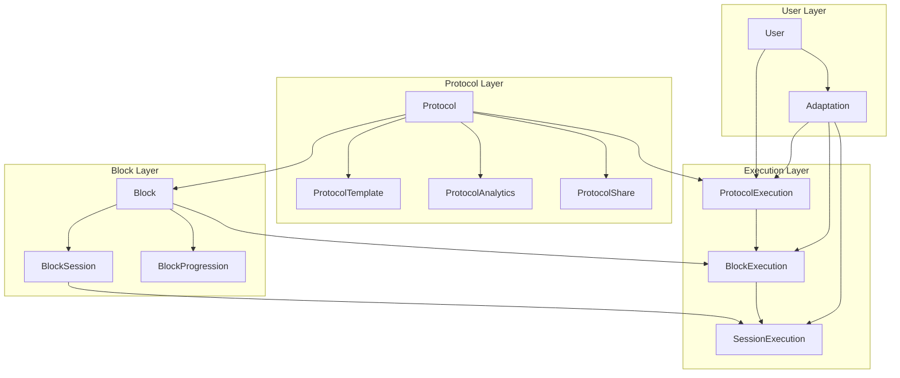
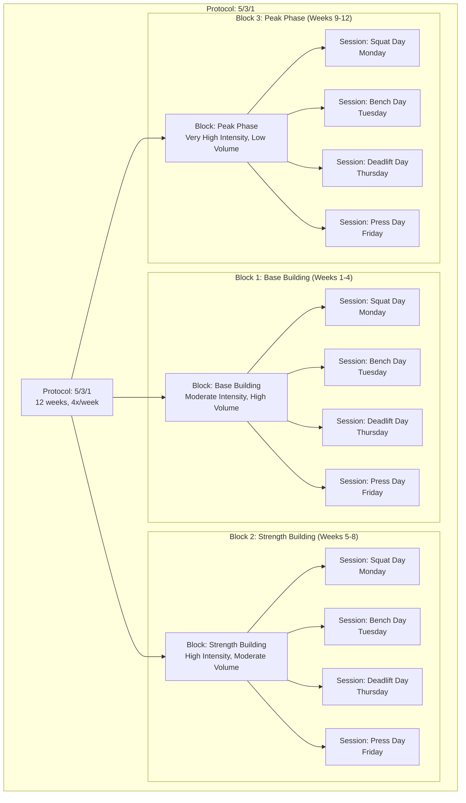
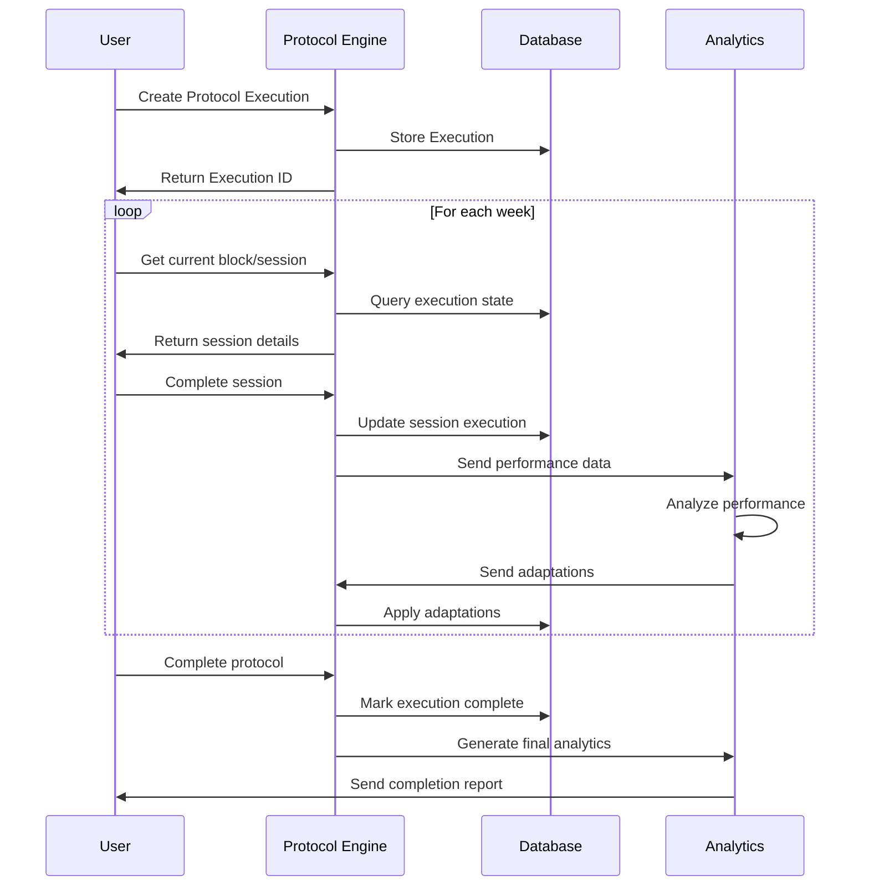

# Protocol Engine Architecture

## Core Concepts Overview



## Protocol Hierarchy



## Data Flow



## Key Relationships

### Protocol → Block
- One-to-Many relationship
- Blocks define phases within a protocol
- Each block has a specific order and duration

### Block → BlockSession
- One-to-Many relationship
- Sessions define specific training days
- Each session has exercises and parameters

### Protocol → ProtocolExecution
- One-to-Many relationship
- Tracks user's execution of a protocol
- Contains user-specific adaptations

### Block → BlockExecution
- One-to-Many relationship
- Tracks execution of specific blocks
- Contains block-specific adaptations

### Session → SessionExecution
- One-to-Many relationship
- Tracks individual session completions
- Contains performance metrics

## Configuration Flexibility

### Block Parameters
```typescript
interface BlockParameters {
  intensityRange?: { min: number; max: number };
  volumeRange?: { min: number; max: number };
  rpeRange?: { min: number; max: number };
  exerciseCategories?: string[];
  movementPatterns?: string[];
  restDays?: number[];
  deloadFrequency?: number;
  custom?: Record<string, any>;
}
```

### Progression Rules
```typescript
interface BlockRules {
  progressionType?: 'linear' | 'double_progression' | 'percentage' | 'rpe_based';
  progressionRate?: number;
  deloadTriggers?: DeloadTrigger[];
  adaptationRules?: AdaptationRule[];
  custom?: Record<string, any>;
}
```

## Benefits

1. **Modularity**: Protocols are composed of reusable blocks
2. **Flexibility**: JSON-based parameters allow for complex configurations
3. **Adaptability**: Built-in adaptation system for personalized training
4. **Scalability**: Supports both simple and complex training methodologies
5. **Analytics**: Comprehensive tracking and analysis capabilities
6. **Collaboration**: Sharing and permission management
7. **Type Safety**: Full TypeScript support for development safety
